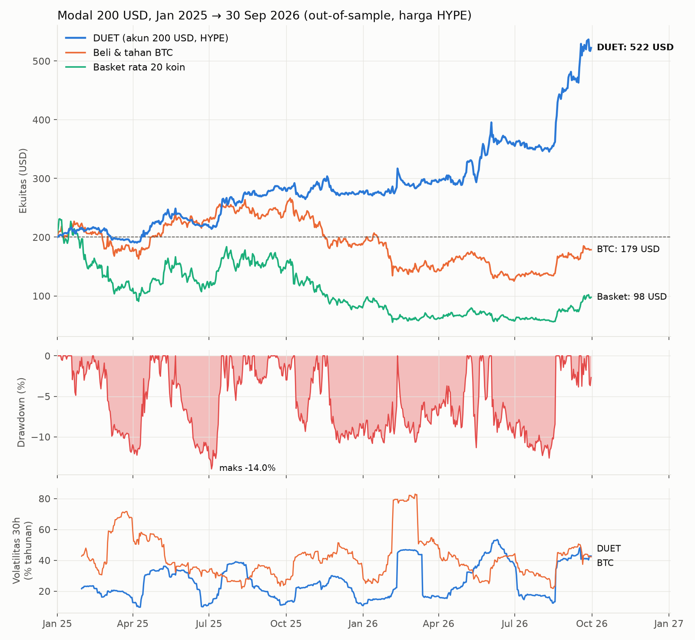
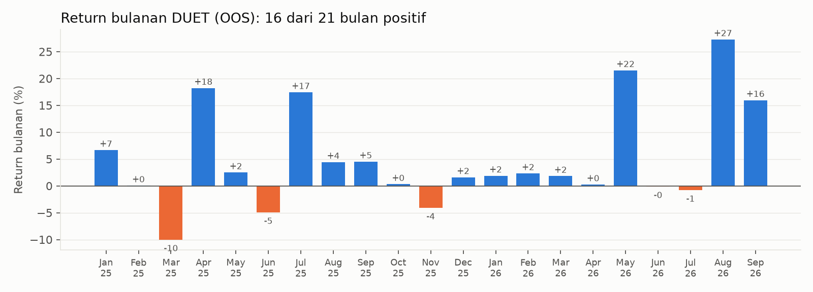
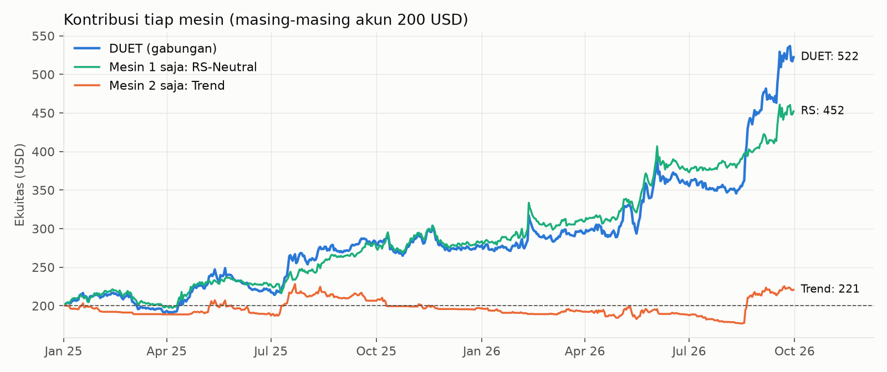
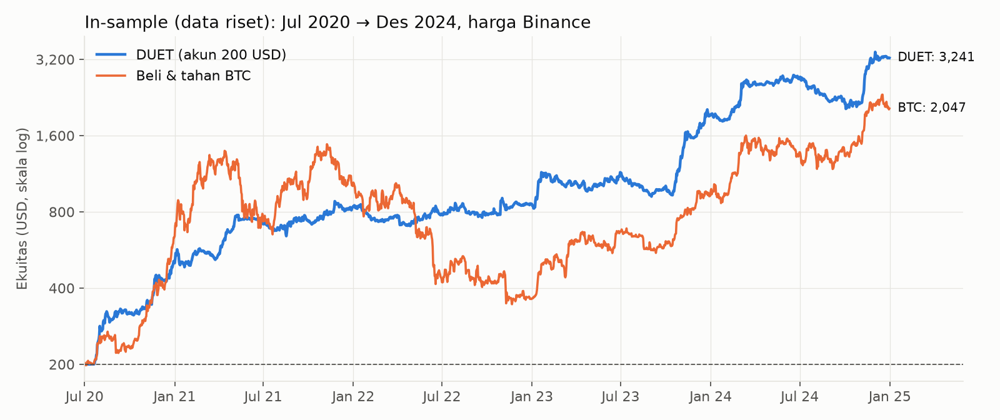

# Crypto-RS-Neutral & Trend — Strategi **RNT** untuk HYPE (modal 200 USD)

*Ditulis 2026-10-09. Riset di data lake `C:\Crypto data\backtest data and more`. Semua kode, data tambahan, dan hasil ada di folder ini.*

> ## ⚠️ Pembaruan setelah audit (2026-10-09) — baca ini dulu
>
> Audit independen ([audit_2026-10-09](audit_2026-10-09/README.md)) menemukan cacat pada aturan umur koin dan beberapa klaim yang salah di laporan ini. Respons lengkap dengan bukti data: [audit_response/AUDIT_RESPONSE.md](audit_response/AUDIT_RESPONSE.md). Strategi yang berlaku sekarang: **[RNT v1.1](SPEC_v1.1.md)**.
>
> | | v1.0 (laporan di bawah) | **v1.1 (berlaku)** |
> |---|---|---|
> | OOS 200 USD → 30 Sep 2026 | 522 USD | **440 USD** (tidak murni lagi, karena perbaikan dibuat setelah OOS dilihat) |
> | 2025 / 2026 (Jan–Sep) | +38% / +89% | **+15% / +92%** |
> | Nilai per 31 Jul 2026 | 354 USD | **299 USD**. Agu–Sep 2026 saja menyumbang +47% |
> | Sharpe / Sortino / max DD OOS | 2,05 / 3,50 / −14,0% | **1,69 / 2,95 / −16,2%** |
> | IS (koin mati + funding riil) | 2.651 USD | **3.360 USD**, Sharpe 2,09, DD −25,5% |
> | Underwater terlama di IS | ~~338 hari~~ | **705–715 hari** (Nov 2021 → Nov 2023) |
>
> **Koreksi atas klaim di laporan ini:**
> - ~~"Mesin 1 bekerja di pasar turun dan sideways"~~ **salah.** Di IS, Mesin 1 untung +54%/tahun saat BTC 90 hari naik dan **rugi −6%/tahun saat turun**. Beta-nya netral, tapi alpha-nya pro-siklus.
> - ~~"Parameter dipilih dari tengah dataran, bukan puncak"~~ **salah.** Parameter itu peringkat 1 dari 60 di IS, dan peringkat IS tidak meramalkan OOS (korelasi 0,06). Ekspektasi yang jujur = median keluarga parameter.
> - ~~"Ekspektasi Sharpe 1,0–1,3, CAGR 25–45%"~~ → **median ±+25%/tahun, peluang rugi 12 bulan ±26–42%, DD sampai −35–40%.**
> - ~~"Stop kalau DD > 35%"~~ → alarm baru: **kuning di DD 20% atau CUSUM, merah di DD 25%**, ditambah cek bulanan live vs backtest.
> - Profit sangat terkonsentrasi: 10 posisi = 97% profit OOS v1.1. Ini sifat struktural (IS: 5 posisi = 47%).
> - **Keyakinan direvisi: 5/10** (sebelumnya 6/10).

## Ringkasan 1 menit (v1.0, sebelum audit)

**Modal 200 USD pada 1 Jan 2025 → 522 USD pada 30 Sep 2026 (+161%).** Ini hasil out-of-sample murni:
- Harga HYPE, termasuk koin yang sudah delist.
- Fee 0,07% per sisi dan funding HYPE riil per jam dihitung sebagai biaya.
- Order minimum 10 USD.

Di periode yang sama, beli & tahan BTC jadi 179 USD dan basket rata 20 koin likuid jadi 98 USD.

| OOS Jan 2025 → Sep 2026 | RNT | BTC beli & tahan | Basket 20 koin |
|---|---|---|---|
| 200 USD menjadi | **522 USD** | 179 USD | 98 USD |
| CAGR | **73%** | −6% | −34% |
| Sharpe / Sortino | **2,05 / 3,50** | 0,07 / 0,10 | −0,13 / −0,18 |
| Max drawdown | **−14,0%** | −53% | −76% |
| Rata-rata drawdown | −5,7% | −15,6% | — |

- **Ide:** dua mesin yang saling melengkapi.
  1. **RS-Neutral** — long 4–8 koin dengan kekuatan relatif (risk-adjusted) terbaik dan short 4–8 koin terlemah, dalam jumlah dolar yang sama. Market-neutral.
  2. **Trend** — long-only pada 5 koin paling likuid saat harganya berada di bagian atas channel 20/55/100 hari.
- **Tanpa VPS.** Hanya butuh candle harian HYPE (`api.hyperliquid.xyz`, bisa diakses dari jaringan rumah). Dijalankan sekali sehari pukul 07:00 WIB. **Tidak memakai OI dan tidak memakai funding sebagai sinyal.**
- **Keyakinan saya: 6/10.** Edge-nya lolos semua uji yang saya punya: OOS, survivorship, biaya 2×, eksekusi telat, parameter tetangga, dan tanpa koin terbaik. Tetapi profitnya datang **bergelombang**: 5 bulan menghasilkan hampir seluruh kenaikan. Selain itu, mesin Trend datar selama OOS.



---

## 1. Cara saya mencari edge

Disiplin yang saya pakai:
1. Uji semua hipotesis **hanya di in-sample** (Binance perp, Jul 2020 → Des 2024).
2. Pilih yang ada di **dataran parameter yang lebar**, bukan di puncak. *[Koreksi audit: menurut grid 60 varian, parameter terpilih justru peringkat 1 di IS, dan peringkat IS tidak meramalkan OOS (korelasi 0,06).]*
3. **Kunci spesifikasinya** di [SPEC_FROZEN.md](SPEC_FROZEN.md).
4. Baru jalankan **OOS satu kali** (Jan 2025 → Sep 2026, sesuai permintaan) di harga HYPE.

Setelah OOS tidak ada parameter yang diubah. Total sekitar **290 konfigurasi** diuji di IS.

Korelasi return harian Binance vs HYPE di 2025–2026 adalah **0,9998**. Karena itu IS di Binance mewakili HYPE dengan baik.

### Hipotesis yang diuji

Hanya dua keluarga yang lolos: momentum relatif dan tren. Sisanya gugur.

| # | Hipotesis (semua hanya OHLCV) | Hasil IS | Status |
|---|---|---|---|
| 1 | **Momentum relatif market-neutral, risk-adjusted** (return ÷ volatilitas) | Sharpe 1,0–1,57 di semua lookback 7–42 hari | ✅ **Mesin 1** |
| 2 | **Tren long-only** (posisi di channel Donchian 20/55/100) | Sharpe 1,04–1,42 | ✅ **Mesin 2** |
| 3 | Momentum relatif dengan return mentah (bukan risk-adjusted) | Sharpe 0,6–1,0, tidak stabil antar lookback | ❌ kalah dari #1 |
| 4 | Tren long/short (short saat downtrend) | Sharpe 0,4–0,5 | ❌ sisi short merusak |
| 5 | Short-term reversal (beli yang turun kemarin) | Sharpe −1,0 s/d −1,9 | ❌ justru kebalikannya yang benar |
| 6 | Low-vol anomaly (long koin tenang, short koin liar) | Sharpe −0,84 | ❌ |
| 7 | Short koin baru listing (hari 3–120) | Sharpe −0,7 s/d −0,9 | ❌ |
| 8 | Fade pump (short koin naik >30–50% vs BTC dalam 3 hari) | Sharpe −0,5 s/d −1,3 | ❌ pump cenderung berlanjut |
| 9 | Kapitulasi breadth (banyak koin di low 20 hari → beli) | t < 1 | ❌ |
| 10 | Breadth thrust (≤25% → ≥65% koin di atas SMA20) | t < 1,2 | ❌ |
| 11 | BTC kompresi volatilitas → breakout | n terlalu kecil, t < 1,8 | ❌ |
| 12 | Hari dalam minggu | tidak ada yang signifikan | ❌ |
| 13 | Jam dalam hari (BTC/ETH 1h) | jam 21–22 UTC positif (t ±2,1–2,4, stabil), tapi hanya ±7 bp, di bawah biaya 9 bp | ❌ tidak bisa ditradingkan |
| 14 | "Gap CME pasti terisi" | Kebalikannya: gap **berlanjut** (korelasi +0,20); fade gap rugi −1,3% per event | ❌ mitos |
| 15 | Rezim breadth (long basket saat >50% koin di atas SMA50) | Sharpe 1,22, tapi DD −44% | ❌ hanya beta pasar |

## 2. Ide strategi dan penjelasannya

### Mesin 1 — RS-Neutral (kekuatan relatif, market-neutral)

**Ide:** di crypto, uang mengalir mengejar koin yang sedang kuat. Penyebabnya narasi, perhatian ritel, listing, dan jadwal unlock. Koin lemah cenderung tetap lemah, karena unlock, narasi mati, dan holder yang keluar pelan-pelan. Strategi ini membeli kekuatan relatif dan menjual kelemahan relatif. Dua hal membuatnya berbeda dari momentum biasa:

1. **Risk-adjusted.** Yang diranking adalah return ÷ volatilitas, bukan return mentah. Ranking return mentah selalu dipenuhi koin "lotre" yang naik 40% karena memang liar. Dengan risk-adjusted, yang terpilih adalah koin yang naik **dengan konsisten**. Di IS, perubahan ini saja menaikkan Sharpe dari ±0,9 ke ±1,4.
2. **Market-neutral.** Nilai long = nilai short, jadi naik-turunnya pasar hampir tidak berpengaruh. Beta terhadap BTC hanya **0,11**. Profit datang dari **selisih performa antar koin** (dispersi), bukan dari arah pasar. Itulah sebabnya mesin ini tetap untung saat BTC −53% dari puncak di OOS.

Detail yang penting:
- Skor adalah rata-rata dari 4 lookback (7, 14, 28, 56 hari), supaya tidak bergantung pada satu angka.
- Ada **buffer**: masuk saat peringkat ≤4, keluar hanya kalau peringkat >8. Buffer ini memotong turnover sampai setengahnya dan menaikkan Sharpe IS dari 1,09 ke 1,44 (lookback 14/28).
- **Wajib diperbarui harian.** Kalau ranking hanya diperbarui mingguan, Sharpe IS jatuh dari 1,44 ke 0,57. Sebagian edge-nya ada di informasi beberapa hari terakhir.

### Mesin 2 — Trend (long-only, 5 koin paling likuid)

**Ide:** di bull market, koin besar yang sedang di atas channel-nya cenderung terus naik. Sinyalnya bukan "beli/jual" biner. Ukuran posisi mengikuti **seberapa tinggi close di dalam channel 20/55/100 hari**: makin dekat ke atas, makin besar posisinya. Di bawah tengah channel, posisinya nol (cash). Karena sinyalnya halus, whipsaw lebih sedikit dan turnover rendah (0,06×/hari).

### Kenapa digabung

- Korelasi kedua mesin **−0,02** di OOS dan 0,16 di IS.
- ~~Mesin 1 bekerja di pasar turun dan sideways yang dispersinya tinggi.~~ *[Koreksi audit: salah. Mesin 1 untung terutama saat BTC naik (IS +54%/th vs −6%/th saat turun). Dispersi tinggi memang membantu, tetapi kombinasi 'turun + dispersi tinggi' negatif di IS.]* Mesin 2 bekerja di bull market.
- Masing-masing diskala ke **volatilitas 20%/tahun**, lalu dijumlahkan (risk parity). Total gross dibatasi maksimal 2,5× ekuitas.
- Di IS, gabungannya (Sharpe 1,91) jauh lebih baik dari masing-masing mesin (1,41 dan 1,49).

## 3. Aturan lengkap (spesifikasi beku)

| Item | Aturan |
|---|---|
| Jadwal | Sekali sehari setelah close harian 00:00 UTC = **07:00 WIB** |
| Data | Candle harian (1d) semua perp HYPE. Koin wajib punya ≥200 candle |
| Likuiditas | Rata-rata quote volume 30 hari, diranking |
| Volatilitas koin | EWM std return harian (span 30) × √365 |
| **Mesin 1 universe** | 20 koin paling likuid |
| Skor | Rata-rata persentil lintas koin dari return(L) ÷ (vol × √(L/365)), L = 7, 14, 28, 56 |
| Long | Masuk kalau peringkat ≤ 4, tahan selama peringkat ≤ 8 |
| Short | Kebalikannya (4 terlemah, tahan selama ≤ 8 dari bawah) |
| Bobot | Rata per leg, 50% long / 50% short |
| **Mesin 2 universe** | 5 koin paling likuid |
| Sinyal | Rata-rata posisi close di channel 20/55/100 hari, diskala ke −1..+1 |
| Bobot | max(0, sinyal) × (40% ÷ vol koin) ÷ 5, maksimal 1,5 per koin |
| Penskalaan | Tiap mesin dikali (20% ÷ realized vol 60 hari buku itu), faktor maksimal 2× |
| Batas | Total gross ≤ 2,5× ekuitas |
| Eksekusi | Target USD = bobot × ekuitas |
| | Target < 10 USD: dibulatkan ke 10 kalau ≥ 5, selain itu 0 |
| | Posisi searah tidak disentuh selama selisihnya ≤ max(10 USD, 40% target) |
| Stop harga | **Tidak ada.** Keluar hanya lewat aturan peringkat, sinyal, dan penskalaan |

Kode: [code/rnt.py](code/rnt.py) (sinyal) dan [code/account.py](code/account.py) (simulasi akun).

## 4. Hasil OOS: Jan 2025 → 30 Sep 2026 (harga HYPE, akun 200 USD)

### Angka utama

| Metrik | Nilai |
|---|---|
| **200 USD menjadi** | **522,39 USD** (+161,2%) |
| 2025 (Jan–Des) | **+38,3%** (200 → 276,6) |
| 2026 (Jan–Sep) | **+88,8%** (276,6 → 522,4) |
| CAGR | 73,2% |
| Volatilitas tahunan | 28,8% |
| **Sharpe** (harian × √365, rf 0) | **2,05** (t-stat 2,71) |
| **Sortino** | **3,50** |
| Calmar | 5,24 |
| **Max drawdown** | **−14,0%** (dasar 4 Jul 2025) |
| **Rata-rata drawdown** | **−5,7%** (25 episode > 1%) |
| Underwater terlama | 83 hari |
| Bulan positif | 16 dari 21 |
| Bulan terbaik / terburuk | Agu 2026 +27,3% / Mar 2025 −10,1% |
| Hari terbaik / terburuk | +11,3% / −6,3% (4 Jun 2026) |
| Beta ke BTC | 0,11 |

### Trade

| Metrik | Nilai |
|---|---|
| **Jumlah order** | **1.647** (beli/jual, termasuk resize) |
| **Rata-rata order per bulan** | **78** (±2,6 per hari) |
| Jumlah posisi selesai (buka → tutup) | 650 |
| **Rata-rata posisi selesai per bulan** | **31** |
| Lama pegang | median 7 hari, rata-rata 11,3 hari |
| Win rate per posisi | 41% (long 32%, short 53%) |
| Rata-rata untung / rugi per posisi | +3,10 / −1,71 USD (rasio 1,8) |
| Profit factor | 1,27 |
| Kontribusi leg (termasuk posisi terbuka) | long +202 USD, short +120 USD |
| Total fee | 21,2 USD (±12 USD/tahun) |
| Total funding (biaya bersih) | 10,1 USD |
| Leverage gross rata-rata / maksimal | 0,89× / 1,83× |
| Leverage net rata-rata | +0,21× (sedikit net long dari mesin Trend) |

> **Catatan:** 144 USD dari total profit 322 USD masih berupa posisi terbuka per 30 Sep 2026, dihitung dengan harga pasar (terutama long ZEC +58, NEAR +32, ETH +24, UNI +22). Angka itu bisa berubah sebelum posisinya ditutup.

### Return bulanan



| | Jan | Feb | Mar | Apr | Mei | Jun | Jul | Agu | Sep | Okt | Nov | Des | Tahun |
|---|---|---|---|---|---|---|---|---|---|---|---|---|---|
| 2025 | +6,7 | 0,0 | −10,1 | +18,2 | +2,5 | −5,0 | +17,4 | +4,4 | +4,5 | +0,3 | −4,1 | +1,6 | **+38,3** |
| 2026 | +1,9 | +2,3 | +1,8 | +0,2 | +21,5 | −0,2 | −0,8 | +27,3 | +16,0 | | | | **+88,8** |

### Kontribusi tiap mesin



| OOS, akun 200 USD | Akhir | Sharpe | Max DD | 2025 | 2026 |
|---|---|---|---|---|---|
| **RNT (gabungan)** | **522** | **2,05** | **−14,0%** | +38% | +89% |
| Mesin 1 saja (RS-Neutral) | 452 | 2,15 | −11,0% | +41% | +60% |
| Mesin 2 saja (Trend) | 221 | 0,41 | −22,4% | −2% | +12% |

Di OOS, hampir semua profit datang dari Mesin 1. Mesin 2 hanya impas, wajar karena periode ini didominasi bear market. Mesin 2 tetap dipertahankan: di IS (2020–2024, banyak bull) Sharpe-nya 1,49, dan perannya adalah menangkap bull market berikutnya.

### Uji ketahanan OOS (spesifikasi tidak diubah)

| Uji | 200 USD menjadi | Sharpe | Max DD |
|---|---|---|---|
| **Dasar** | **522** | **2,05** | −14,0% |
| Biaya 2× (0,15% per sisi) | 476 | 1,87 | −15,3% |
| Eksekusi telat 1 hari penuh | 450 | 1,77 | −22,2% |
| Tanpa ZEC (koin penyumbang terbesar) | 429 | 1,68 | −15,3% |
| Tanpa ZEC, ENA, NEAR (3 terbesar) | 420 | 1,71 | −15,3% |
| Hanya koin yang masih hidup (bias survivorship) | (versi bobot) Sharpe 1,99 vs 1,89 | | |
| Harga Binance, bukan HYPE (versi bobot) | Sharpe 1,83 | | −16,6% |

**Parameter tetangga di OOS** (hanya dilaporkan, tidak dipakai untuk memilih). Ke-14 variasi semuanya untung: **333–627 USD**, median 483, Sharpe 1,18–2,21. Spesifikasi dasar bukan yang tertinggi. *[v1.1: 16 tetangga, semua untung, 272–556 USD, median 442.]*

| Variasi | Akhir | Sharpe | Variasi | Akhir | Sharpe |
|---|---|---|---|---|---|
| buffer 3/7 | 408 | 1,55 | RS top-15 | 466 | 1,84 |
| buffer 5/9 | 554 | 2,21 | RS top-30 | 412 | 1,66 |
| buffer 4/6 | 440 | 1,68 | trend top-3 | 503 | 2,00 |
| buffer 4/10 | 507 | 1,98 | trend top-8 | 500 | 1,98 |
| lookback 14/28 | 462 | 1,82 | vol mesin 15% | 436 | 2,01 |
| lookback 7/14/28 | 552 | 2,15 | vol mesin 25% | 627 | 2,11 |
| lookback 28/56 | 333 | 1,18 | **dasar** | **522** | **2,05** |

## 5. Hasil IS (data riset): Jul 2020 → Des 2024, harga Binance



| IS, akun 200 USD | Koin hidup saja | **+ 552 koin mati/kecil** (LUNA, FTT, squeeze ALPACA/UNFI, dll.) |
|---|---|---|
| 200 USD menjadi | 3.241 | **2.651** |
| Sharpe | 2,08 | 1,94 |
| Max DD | −26,4% | −33,3% |
| Per tahun 2020 / 21 / 22 / 23 / 24 | +153 / +65 / +3 / +123 / +69% | (versi bobot) +160 / +80 / −14 / +46 / +121% |

Uji survivorship ini memakai 579 perp Binance tambahan yang saya unduh dari arsip `data.binance.vision`. 75 di antaranya pernah masuk universe top-20. Sharpe tetap 1,91 (bobot), jadi **edge-nya tidak bergantung pada bias survivorship**. Koin mati tidak punya data funding di lake, jadi funding-nya dianggap 0.

## 6. Hal menarik lainnya

1. **Saat crash, RNT naik.**
   - 10 Okt 2025: BTC −7,3%, median altcoin −29% → RNT **+0,4%**.
   - 5 Feb 2026: BTC −14% → RNT **+1,75%**.
   - Rata-rata di 45 hari ketika BTC turun >3%: **+0,14%**. Di hari BTC naik >3%: +0,91%.
2. **Profit datang bergelombang.** 5 bulan terbaik (Apr 2025, Jul 2025, Mei 2026, Agu 2026, Sep 2026) melipatgandakan modal 2,5×. 16 bulan lainnya digabung hanya +5%. Di IS polanya sama: **Mei 2021 → Okt 2023 hanya +25% dalam 29 bulan**, dan underwater terlama ~~338 hari~~ **705–715 hari** *(koreksi audit: 338 berasal dari versi koin hidup saja)*. Strategi ini menuntut kesabaran.
3. **Koin yang kuat kemarin tetap kuat hari ini.** "Beli yang turun kemarin" adalah salah satu strategi terburuk di IS (Sharpe −1,9). Edge harian ini nyata, tetapi turnover-nya terlalu mahal kalau diambil mentah. Buffer 4/8 adalah kompromi antara menangkap edge dan membayar biaya.
4. **Leg short bekerja sebagai hedge sekaligus sumber profit.** Di IS (bull), leg short sendirian rugi. Di OOS (bear), leg short untung +120 USD dengan win rate 53%.
5. **Gap CME tidak terisi.** Gap akhir pekan BTC >2% justru berlanjut 48 jam ke depan. Fade-nya rugi rata-rata −1,3% (IS, 75 kejadian).
6. **Jam 21:00–23:00 UTC (04:00–06:00 WIB)** adalah jam dengan drift positif terbesar untuk BTC/ETH, stabil di 2020–22 dan 2023–24. Sayangnya terlalu kecil untuk ditradingkan sendirian.
7. **Biaya hampir tidak berarti di 200 USD:** fee ±12 USD/tahun, funding ±6 USD/tahun.

## 7. Risiko dan kelemahan (jujur)

- ~~**Rezim OOS menguntungkan RS-Neutral.** Bear market 2025–26 dengan dispersi tinggi adalah lingkungan ideal.~~ *[Koreksi audit: profit RNT hampir seluruhnya datang saat BTC 90 hari naik (OOS +98%/th vs +14%/th saat turun). Ekspektasi direvisi: median ±+25%/tahun, peluang rugi 12 bulan ±26–42%, DD sampai −35–40%. Lihat audit_response/AUDIT_RESPONSE.md §5.]*
- **Seleksi:** ±290 konfigurasi diuji di IS. OOS, parameter tetangga, dan uji survivorship mengurangi risiko overfit, tetapi tidak menghapusnya. OOS hanya 21 bulan (t-stat 2,71).
- **Short squeeze.** Candle harian menyembunyikan wick intraday. Di OOS tidak ada posisi yang sempat bergerak >100% melawan (maksimum +69%). Di IS dengan koin mati, rugi per posisi terburuk adalah short TIA Nov 2024 (−76 USD, ±5% ekuitas saat itu) dan long LUNA Mei 2022 (−48 USD).
- **Eksekusi harus tepat waktu.** Telat sehari penuh menurunkan hasil OOS dari 522 ke 450 USD. Telat 10–30 menit tidak masalah.
- **Order minimum 10 USD.** Di 200 USD banyak posisi pas di 10–25 USD, jadi pembulatan sedikit mengubah ukuran. Simulasi sudah menghitung ini.
- **Mesin 2 bisa datar lama.** Di OOS hanya +10% dalam 21 bulan.

## 8. Menjalankan tanpa VPS

1. **07:00–07:15 WIB:** ambil candle 1d semua perp HYPE (`POST https://api.hyperliquid.xyz/info`, `candleSnapshot`). Endpoint ini terbukti bisa diakses dari jaringan rumah.
2. Hitung skor dan target, lalu kirim ±2–4 order. Bisa manual (±5–10 menit) atau lewat bot di PC rumah / GitHub Actions. Tidak perlu data Binance, OI, atau funding.
3. **Margin:** cross margin di **subaccount khusus**, terpisah dari MEX 3.0 dan RMF, karena satu koin hanya bisa punya satu posisi. Gross rata-rata ±0,9×, maksimal ±1,8×.
4. **Aturan berhenti (diganti setelah audit):**
   - Cek teknis bulanan: hasil live vs backtest di hari yang sama, maksimal selisih 3% ekuitas.
   - **Kuning** (posisi dipotong separuh): DD > 20% atau CUSUM berbunyi.
   - **Merah** (stop): DD > 25%.
   - ~~DD > 35%~~ hanya menangkap strategi tanpa edge 46% dalam setahun.
   - Underwater hampir 2 tahun pernah terjadi di IS.

## 9. Peta file

```
Crypto-RS-Neutral & Trend/
  PROJECT CRYPTO - RNT.md        <- laporan ini
  SPEC_FROZEN.md        <- aturan yang dikunci sebelum OOS
  charts/               <- oos_equity_200usd.png, oos_monthly.png, oos_engines.png, is_equity_200usd.png
  code/
    lab.py              <- loader panel harian (Binance, HYPE, + koin delist), engine backtest, metrik
    strat.py            <- blok sinyal (skor RS, buffer, channel Donchian, penskalaan vol)
    rnt.py             <- STRATEGI FINAL (SPEC)
    account.py          <- simulasi akun 200 USD (min order 10, band rebalance, fee, funding)
    explore1..6.py      <- tahap riset IS (hipotesis, dekomposisi, buffer, kombinasi)
    oos.py              <- uji OOS satu kali
    survivorship_is.py  <- IS dengan koin mati
    report_data.py      <- angka dan grafik laporan
    fetch_delisted.py   <- unduh candle koin delist (HYPE API, arsip Binance)
  data/
    hl_delisted/        <- 56 perp HYPE yang sudah delist (1d + funding untuk yang masuk universe)
    bn_dead/            <- 579 perp Binance di luar data lake (mati atau di luar top-150), 1d
  results/              <- semua tabel (stage*_is.csv, oos_*.csv, *.json)
```
