# Crypto-RS-Neutral & Trend — Laporan lengkap strategi **RNT v1.1** (HYPE, modal 200 USD)

*Versi laporan: **2026-10-11** (menggantikan laporan v1.0 tertanggal 2026-10-09; teks v1.0 asli ada di riwayat git).
Riset dijalankan di data lake `C:\Crypto data\backtest data and more`. Kode, tabel hasil, dan grafik ada di folder `research/` repo ini.
Semua grafik di laporan ini dibuat ulang dari aturan v1.1 oleh [code/report_v11_charts.py](code/report_v11_charts.py).*

**Daftar isi**

1. [Ringkasan eksekutif](#1-ringkasan-eksekutif)
2. [Riwayat versi: v1.0 → audit → v1.1 → bot](#2-riwayat-versi-v10--audit--v11--bot)
3. [Cara saya mencari edge, dan 15 hipotesis](#3-cara-saya-mencari-edge-dan-15-hipotesis)
4. [Ide strategi](#4-ide-strategi)
5. [Spesifikasi v1.1](#5-spesifikasi-v11)
6. [Data dan metodologi backtest](#6-data-dan-metodologi-backtest)
7. [Hasil OOS v1.1 (Jan 2025 → Sep 2026)](#7-hasil-oos-v11-jan-2025--sep-2026)
8. [Hasil IS v1.1 (Jul 2020 → Des 2024)](#8-hasil-is-v11-jul-2020--des-2024)
9. [Uji ketahanan](#9-uji-ketahanan)
10. [Karakter risiko: rezim, konsentrasi, distribusi](#10-karakter-risiko-rezim-konsentrasi-distribusi)
11. [Opsi yang dievaluasi tetapi tidak diadopsi: filter rezim](#11-opsi-yang-dievaluasi-tetapi-tidak-diadopsi-filter-rezim)
12. [Ekspektasi 12 bulan dan sistem alarm](#12-ekspektasi-12-bulan-dan-sistem-alarm)
13. [Bot dan infrastruktur](#13-bot-dan-infrastruktur)
14. [Forward test: status per 2026-10-11](#14-forward-test-status-per-2026-10-11)
15. [Cross-check folder lokal vs GitHub](#15-cross-check-folder-lokal-vs-github)
16. [Risiko, keterbatasan, dan yang belum pasti](#16-risiko-keterbatasan-dan-yang-belum-pasti)
17. [Peta file dan cara mereproduksi](#17-peta-file-dan-cara-mereproduksi)

---

## 1. Ringkasan eksekutif

> [!WARNING]
> Angka OOS v1.1 **tidak lagi murni out-of-sample**: perbaikan v1.1 dibuat setelah OOS dilihat. Bukti yang tersisa untuk v1.1 adalah IS dan forward test (baru berjalan 2 hari).

**RNT** adalah dua mesin yang dijumlahkan, dijalankan **sekali sehari** setelah close harian 00:00 UTC (**07:00 WIB**) di perp **HYPE (Hyperliquid)**, tanpa VPS. Sinyalnya hanya candle harian (OHLCV): tanpa OI, tanpa funding sebagai sinyal (funding hanya biaya).

| Mesin | Isi |
|---|---|
| **Mesin 1, RS-Neutral** | Long 4–8 koin dengan kekuatan relatif *risk-adjusted* terbaik, short 4–8 koin terlemah, dari 20 perp paling likuid. Nilai long = nilai short |
| **Mesin 2, Trend** | Long-only pada 5 perp paling likuid; ukuran posisi mengikuti posisi close di channel 20/55/100 hari |
| **Penskalaan** | Tiap mesin diskala ke volatilitas 20%/tahun (faktor maks 2×); gross total maks 2,5× ekuitas |

### Angka kunci (akun 200 USD, biaya 0,07%/sisi + funding riil)

| | **OOS** HYPE, 1 Jan 2025 → 30 Sep 2026 *(tidak murni)* | **IS** Binance + koin mati + funding riil, 1 Jul 2020 → 31 Des 2024 |
|---|---|---|
| **200 USD menjadi** | **440 USD** (+120%) | **3.360 USD** (×16,8) |
| CAGR / volatilitas | 57,1% / 29,3% | 87,0% / 32,5% |
| **Sharpe / Sortino / Calmar** | **1,69 / 2,95 / 3,53** | **2,09 / 3,69 / 3,41** |
| t-stat (Sharpe harian) | 2,23 | 4,43 |
| **Max drawdown** | **−16,2%** (puncak 20 Sep 2025 → dasar 25 Jan 2026) | **−25,5%** (dasar 27 Mei 2023) |
| Rata-rata drawdown | −6,7% | −4,9% |
| **Underwater terlama** | 143 hari | **705 hari** (24 Nov 2021 → 30 Okt 2023) |
| Per tahun kalender | 2025: **+14,8%** · 2026 (Jan–Sep): **+91,8%** | 2020 (Jul–Des) +164 · 2021 +103 · **2022 −15** · 2023 +80 · 2024 +105 |
| Bulan positif | 13 dari 21 | 33 dari 54 |
| Order / bulan · posisi selesai / bulan | 77 · 31 | 93 · 33 |
| Win rate · profit factor | 41,8% · 1,19 | 40,1% · 1,39 |
| Beta ke BTC · korelasi harian ke BTC | 0,11 · 0,17 | 0,21 · 0,40 |
| Pembanding beli & tahan BTC | 179 USD (Sharpe 0,07, DD −53%) | 2.047 USD (Sharpe 1,15, DD −77%) |
| Pembanding basket rata 20 koin | 93 USD (DD −77%) | 729 USD (DD −88%) |

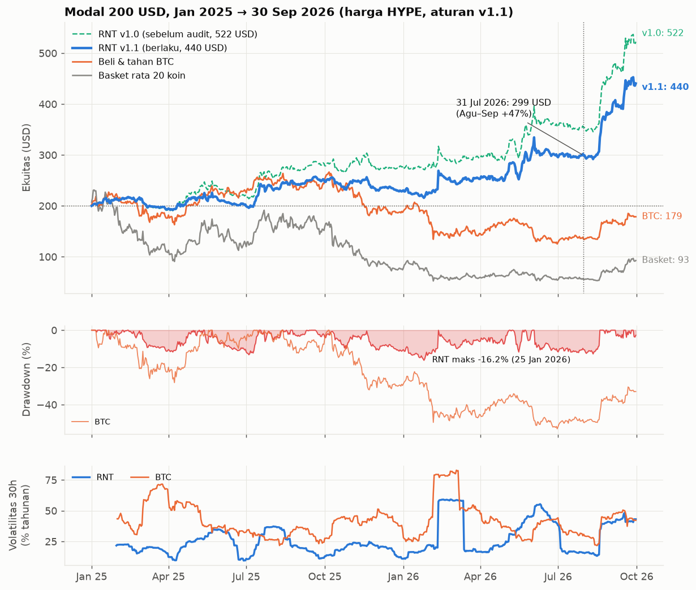

### Hal yang perlu diingat sebelum membaca sisanya

1. **Ekspektasi jujur ke depan jauh di bawah backtest.** Setelah audit: median ±+25%/tahun, peluang rugi 12 bulan ±26–42%, DD sampai −35–40%, masa datar bisa hampir 2 tahun (§12).
2. **Alpha Mesin 1 pro-siklus.** Hampir seluruh profit datang saat BTC 90 hari naik (OOS +98%/tahun vs +14% saat turun). Beta-nya netral, alpha-nya tidak (§10).
3. **Profit terkonsentrasi.** Di OOS v1.1, 10 posisi menyumbang 97% profit. Tanpa 20 posisi terbaik, hasilnya −103 USD. Kondisi yang sama terlihat di IS (§10).
4. **Hasil sangat bergantung tanggal akhir.** Per 31 Jul 2026 nilai akun hanya 299 USD; Agu–Sep 2026 menambah +47%. Dari profit 240 USD di OOS, 121 USD masih posisi terbuka (§7, §9).
5. **Keyakinan: 5/10** (v1.0: 6/10).
6. **Status operasional:** bot jalan di mode **paper** sejak 2026-10-10 (hari ke-2 per laporan ini). Live belum dinyalakan (kunci API wallet belum dipasang). Lihat §13–§14.

---

## 2. Riwayat versi: v1.0 → audit → v1.1 → bot

| Tanggal | Peristiwa |
|---|---|
| 2026-10-09 | Riset v1.0 (nama kerja DUET, kemudian RNT). Spesifikasi dikunci di [SPEC_FROZEN.md](SPEC_FROZEN.md), OOS dijalankan sekali: 200 → 522 USD |
| 2026-10-09 | **Audit independen** oleh user ([audit_2026-10-09](audit_2026-10-09/README.md)): 18 temuan |
| 2026-10-09 | **Respons audit** ([AUDIT_RESPONSE.md](audit_response/AUDIT_RESPONSE.md)): 12 temuan disetujui, 3 disetujui dengan data tambahan, 2 sebagian dibantah, 1 dibantah (funding koin mati). Lahir **v1.1** ([SPEC_v1.1.md](SPEC_v1.1.md)) |
| 2026-10-09 | Bot RNT v1.1 (GitHub Actions) dibangun; paritas dengan kode riset dibuktikan di data nyata |
| 2026-10-10 | `forward_start`: bot paper mulai trading (07:00 WIB). Telegram dan Google Sheets terhubung. Pesan Telegram direvisi (§13.6) |
| 2026-10-11 | Laporan ini: angka v1.1 lengkap + grafik baru + cross-check lokal vs GitHub |

### v1.0 vs v1.1

Hanya dua definisi yang berubah, keduanya dipilih dari data **in-sample**:

| # | v1.0 | v1.1 | Alasan (IS) |
|---|---|---|---|
| 1 | Umur koin = jumlah candle harian, **termasuk** ±999 candle pra-listing yang masih dikirim API HYPE (harga sama dengan Binance, volume 0) | Umur koin = jumlah hari dengan **volume > 0** di HYPE | Replika di IS: v1.0 Sharpe 1,72 vs v1.1 Sharpe 1,92 |
| 2 | Persentil skor antar **semua koin yang punya harga** | Persentil antar koin yang **benar-benar diperdagangkan hari itu** (harga ada **dan** volume > 0) | Netral di IS (1,92 vs 1,95); terdefinisi jelas dan sama persis dengan yang dihitung bot |

| | v1.0 (laporan awal) | **v1.1 (berlaku)** |
|---|---|---|
| OOS 200 USD → 30 Sep 2026 | 522 USD | **440 USD** |
| 2025 / 2026 (Jan–Sep) | +38% / +89% | **+15% / +92%** |
| Nilai per 31 Jul 2026 | 354 USD | **299 USD** |
| Sharpe / Sortino / Max DD OOS | 2,05 / 3,50 / −14,0% | **1,69 / 2,95 / −16,2%** |
| Underwater terlama OOS | 83 hari | **143 hari** |
| IS (koin mati + funding riil) | 2.651 USD (funding koin mati = 0) | **3.360 USD**, Sharpe 2,09, DD −25,5% |
| Underwater terlama IS | ~~338 hari~~ (versi koin hidup) | **705 hari** |
| Keyakinan | 6/10 | **5/10** |

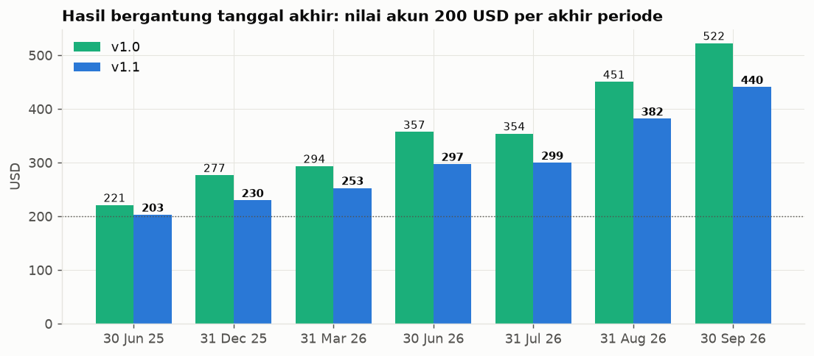

### Klaim v1.0 yang **salah** dan sudah dikoreksi

| Klaim lama | Koreksi (bukti di AUDIT_RESPONSE) |
|---|---|
| "Mesin 1 bekerja di pasar turun dan sideways" | **Salah.** IS: Mesin 1 untung +54%/tahun saat BTC 90 hari naik dan **rugi −6%/tahun saat turun**. Kombinasi "turun + dispersi tinggi" justru negatif di IS |
| "Parameter dipilih dari tengah dataran, bukan puncak" | **Salah.** Parameter terpilih peringkat 1 dari 60 varian di IS, dan peringkat IS tidak meramalkan OOS (korelasi 0,06). Ekspektasi jujur = median keluarga parameter |
| "Ekspektasi Sharpe 1,0–1,3, CAGR 25–45%" | Median ±+25%/tahun, peluang rugi 12 bulan ±26–42%, DD sampai −35–40% |
| "Stop kalau DD > 35%" | Aturan itu hanya menangkap strategi tanpa edge 46% dalam setahun. Diganti: kuning DD 20% atau CUSUM, merah DD 25%, plus cek teknis bulanan |
| "Underwater terlama 338 hari" | 705–715 hari (338 berasal dari versi koin hidup saja) |
| "Funding koin mati menjadi penalti" (audit) | **Dibantah dengan data riil:** funding koin mati bagi strategi = **+5,4%/tahun diterima**, bukan dibayar (terkonsentrasi di BLZ ±1/3) |

---

## 3. Cara saya mencari edge, dan 15 hipotesis

Disiplin yang dipakai:

1. Uji semua hipotesis **hanya di in-sample** (Binance perp, Jul 2020 → Des 2024).
2. Pilih yang konsisten di banyak parameter. *[Koreksi audit: parameter terpilih ternyata peringkat 1 di IS; klaim "bukan puncak" dicabut.]*
3. **Kunci spesifikasi** di [SPEC_FROZEN.md](SPEC_FROZEN.md).
4. Baru jalankan **OOS satu kali** (Jan 2025 → Sep 2026) di harga HYPE.

Total ±290 konfigurasi diuji di IS. Korelasi return harian Binance vs HYPE di 2025–2026 adalah **0,9998**, jadi IS di Binance mewakili HYPE.

Catatan prosedur (dari audit, §#3): sebelum spesifikasi dikunci, data 2025+ disentuh dua kali, keduanya **tanpa PnL strategi** (korelasi Binance–HYPE, dan daftar koin delist untuk menentukan funding mana yang diunduh). PnL OOS pertama keluar dari `oos.py` setelah `SPEC_FROZEN.md` ditulis. Satu hal diakui: **v1.1 dibuat setelah OOS dilihat.**

| # | Hipotesis (semua hanya OHLCV) | Hasil IS | Status |
|---|---|---|---|
| 1 | **Momentum relatif market-neutral, risk-adjusted** (return ÷ volatilitas) | Sharpe 1,0–1,57 di semua lookback 7–42 hari | ✅ **Mesin 1** |
| 2 | **Tren long-only** (posisi di channel Donchian 20/55/100) | Sharpe 1,04–1,42 | ✅ **Mesin 2** |
| 3 | Momentum relatif dengan return mentah | Sharpe 0,6–1,0, tidak stabil antar lookback | ❌ kalah dari #1 |
| 4 | Tren long/short (short saat downtrend) | Sharpe 0,4–0,5 | ❌ sisi short merusak |
| 5 | Short-term reversal (beli yang turun kemarin) | Sharpe −1,0 s/d −1,9 | ❌ kebalikannya yang benar |
| 6 | Low-vol anomaly (long koin tenang, short koin liar) | Sharpe −0,84 | ❌ |
| 7 | Short koin baru listing (hari 3–120) | Sharpe −0,7 s/d −0,9 | ❌ |
| 8 | Fade pump (short koin naik >30–50% vs BTC dalam 3 hari) | Sharpe −0,5 s/d −1,3 | ❌ pump cenderung berlanjut |
| 9 | Kapitulasi breadth (banyak koin di low 20 hari → beli) | t < 1 | ❌ |
| 10 | Breadth thrust (≤25% → ≥65% koin di atas SMA20) | t < 1,2 | ❌ |
| 11 | BTC kompresi volatilitas → breakout | n terlalu kecil, t < 1,8 | ❌ |
| 12 | Hari dalam minggu | tidak ada yang signifikan | ❌ |
| 13 | Jam dalam hari (BTC/ETH 1h) | jam 21–22 UTC positif (t ±2,1–2,4, stabil) tetapi ±7 bp, di bawah biaya 9 bp | ❌ tidak bisa ditradingkan |
| 14 | "Gap CME pasti terisi" | Kebalikannya: gap **berlanjut** (korelasi +0,20); fade rugi −1,3% per event | ❌ mitos |
| 15 | Rezim breadth (long basket saat >50% koin di atas SMA50) | Sharpe 1,22 tetapi DD −44% | ❌ hanya beta pasar |

Tahap riset IS tersimpan di `code/explore1–6.py` dan `results/stage*_is.csv`.

---

## 4. Ide strategi

### Mesin 1 — RS-Neutral (kekuatan relatif, market-neutral)

Di crypto, uang mengejar koin yang sedang kuat (narasi, perhatian ritel, listing, unlock); koin lemah cenderung tetap lemah. Strategi membeli kekuatan relatif dan menjual kelemahan relatif. Dua hal membedakannya dari momentum biasa:

1. **Risk-adjusted.** Yang diranking adalah return ÷ volatilitas, bukan return mentah. Ranking return mentah dipenuhi koin "lotre". Di IS, perubahan ini saja menaikkan Sharpe dari ±0,9 ke ±1,4.
2. **Market-neutral.** Nilai long = nilai short, jadi **beta** terhadap BTC rendah (OOS 0,11; IS 0,21). Profit datang dari selisih performa antar koin (dispersi). *Catatan audit: beta netral tidak berarti alpha netral rezim — lihat §10.*

Detail penting:

- Skor = rata-rata persentil dari 4 lookback (7, 14, 28, 56 hari).
- **Buffer:** masuk saat peringkat ≤ 4, keluar hanya kalau peringkat > 8. Memotong turnover sampai setengahnya (Sharpe IS 1,09 → 1,44 pada lookback 14/28).
- **Wajib diperbarui harian.** Kalau ranking hanya diperbarui mingguan, Sharpe IS jatuh dari 1,44 ke 0,57.

### Mesin 2 — Trend (long-only, 5 koin paling likuid)

Koin besar yang di atas channel-nya cenderung terus naik. Sinyal tidak biner: ukuran posisi mengikuti seberapa tinggi close di channel 20/55/100 hari; di bawah tengah channel posisi nol (cash). Sinyal halus → whipsaw sedikit, turnover rendah (0,06×/hari).

### Kenapa digabung

| | OOS v1.1 | IS v1.1 |
|---|---|---|
| Korelasi harian Mesin 1 vs Mesin 2 | 0,02 | 0,21 |
| Sharpe Mesin 1 / Mesin 2 / gabungan | 1,67 / 0,48 / **1,69** | 1,64 / 1,58 / **2,09** |

Mesin 2 hanya impas di OOS (periode dominan bear), tetapi di IS (banyak bull) ia sekelas Mesin 1 dan menambah Sharpe gabungan dari 1,6 ke 2,1. Perannya: menangkap bull market. Konsekuensinya: **hasil gabungan di OOS hampir seluruhnya dari Mesin 1** (383 dari 440 USD jika berdiri sendiri).

---

## 5. Spesifikasi v1.1

Spesifikasi lengkap 13 langkah dengan rumus ada di [SPEC_v1.1.md](SPEC_v1.1.md). Ringkasan:

| Item | Aturan |
|---|---|
| Jadwal | Sekali sehari setelah close 00:00 UTC (07:00 WIB) |
| Data | Candle 1d semua perp HYPE yang belum delist; stablecoin dan emas dikeluarkan (USDC, USDT, USDE, USDH, FDUSD, DAI, PYUSD, USD1, PAXG, XAUT, USTC) |
| Aktif (hari d) | close ada **dan** quote volume > 0 (quote volume = volume × rata-rata OHLC) |
| Umur | jumlah hari dengan Aktif = benar; syarat ≥ 200 |
| Likuiditas | rata-rata quote volume 30 hari (min 15 hari data) |
| Volatilitas koin | EWM std return harian (span 30, min 15) × √365 |
| **Universe Mesin 1** | 20 koin paling likuid |
| Skor RS | rata-rata, untuk L ∈ {7, 14, 28, 56}, dari persentil nilai [return L hari ÷ (vol × √(L/365))], dihitung di antara **semua koin Aktif hari itu** |
| Long / Short | masuk jika peringkat ≤ 4, tahan selama ≤ 8; short kebalikannya; keluar dari universe = keluar dari buku |
| Bobot Mesin 1 | rata per leg; total long +0,5, total short −0,5 (sebelum penskalaan) |
| **Universe Mesin 2** | 5 koin paling likuid |
| Sinyal Trend | rata-rata posisi close di channel 20/55/100 hari, diskala −1…+1 |
| Bobot Mesin 2 | max(0, sinyal) × (40% ÷ vol koin), maks 1,5, lalu ÷ 5 |
| Penskalaan | faktor = min(2, 20% ÷ realized vol 60 hari buku itu), per mesin |
| Batas | Σ\|W\| ≤ 2,5 (semua bobot dikecilkan proporsional jika lebih) |
| Eksekusi | target USD = bobot × ekuitas; target < 10 USD → 10 jika ≥ 5, selain itu 0; posisi searah tidak disentuh selama selisih ≤ max(10 USD, 40% target); order < 10 USD tidak dikirim kecuali menutup |
| Stop harga | **Tidak ada.** Keluar hanya lewat aturan peringkat, sinyal, dan penskalaan |
| Margin | cross, di subaccount khusus |
| Biaya backtest | 0,07%/sisi (fee taker HYPE 0,045% + slippage 0,025%) + funding HYPE per jam riil (biaya saja) |

Parameter di bot ([config.yaml](../config.yaml)) sama dengan tabel ini. Mengubahnya membuat forward test tidak sebanding dengan backtest, dan perubahan harus dicatat di [CHANGELOG.md](../CHANGELOG.md).

---

## 6. Data dan metodologi backtest

| Periode | Data | Catatan |
|---|---|---|
| **IS** 2020-07-01 → 2024-12-31 (1.645 hari) | Perp Binance (data lake) + **579 perp Binance tambahan** dari arsip `data.binance.vision` (koin mati/kecil; 75 di antaranya pernah masuk top-20) + **funding riil 70 koin mati** dari arsip yang sama | Koin hidup saja vs + koin mati dibedakan di §8 |
| **OOS** 2025-01-01 → 2026-09-30 (638 hari) | Candle HYPE (data lake) + **56 perp HYPE yang sudah delist** (`research/data/hl_delisted`) + funding HYPE per jam riil | 15 koin kecil OOS tidak ada di Binance (4,5% posisi) |

- **Simulator akun** ([code/account.py](code/account.py)): ekuitas 200 USD, target USD = bobot × ekuitas, minimum order 10 USD, band 40%, fee + slippage 0,07% per sisi, funding riil. Mengeksekusi di close hari d (07:00 WIB) dan menghitung PnL harga harian.
- **Hari-d tanpa look-ahead:** audit menguji selisih bobot = 0 dengan data yang dipotong, dan 0 order di hari volume 0.
- **Validasi independen:** audit membuat ulang backtest dari spesifikasi dengan implementasi sendiri (`dq.py`); v1.0 cocok sampai sen (522,39 = 522,39) dan v1.1 cocok (440,5 = 440,5).
- **Biaya 2×** = 0,15%/sisi (≈2,1× biaya dasar). **Telat 1 hari** = bobot digeser satu hari (order dikirim 24 jam setelah sinyal).
- **Benchmark:** beli & tahan BTC (200 USD, tanpa biaya) dan basket rata 20 koin (universe RS v1.1 hari sebelumnya, rebalance harian, tanpa biaya). Basket ini 93 USD di OOS, sedikit berbeda dari 98 di laporan v1.0 karena definisi universe v1.1.
- **Definisi metrik** (harian, rf = 0): Sharpe = rata-rata ÷ std × √365; Sortino dengan downside deviasi; Calmar = CAGR ÷ |max DD|; underwater = jumlah hari beruntun di bawah puncak ekuitas.
- **Seri harian v1.1** untuk laporan ini: `results/v11_series_oos.csv` dan `results/v11_series_is.csv` (kolom: RNT, Mesin 1, Mesin 2, biaya 2×, telat 1 hari, filter rezim, BTC, basket, v1.0, leverage, order, fee, funding), dibuat oleh [code/report_v11_data.py](code/report_v11_data.py). Angka dasar identik dengan `audit_response/r05_v11.json` (OOS 440,4546; IS 3.359,52).

---

## 7. Hasil OOS v1.1 (Jan 2025 → Sep 2026)

Akun 200 USD, harga HYPE, aturan v1.1. Setiap angka kecuali yang ditandai dihitung dari `v11_series_oos.csv` dan `audit_response/r05_v11.json`.

### 7.1 Angka utama

| Metrik | Nilai |
|---|---|
| **200 USD menjadi** | **440,45 USD** (+120,2%) |
| 2025 (Jan–Des) / 2026 (Jan–Sep) | **+14,8%** (200 → 229,7) / **+91,8%** (229,7 → 440,5) |
| CAGR / volatilitas tahunan | 57,1% / 29,3% |
| **Sharpe** (t-stat) | **1,69** (2,23) |
| Sortino / Calmar | 2,95 / 3,53 |
| **Max drawdown** | **−16,2%** (puncak 20 Sep 2025 → dasar 25 Jan 2026 → pulih 11 Feb 2026) |
| Rata-rata drawdown (per episode, definisi audit) | −6,7% |
| Underwater terlama | 143 hari |
| Bulan positif | 13 dari 21 |
| Bulan terbaik / terburuk | Agu 2026 **+27,4%** / Mar 2025 **−9,9%** |
| Hari terbaik / terburuk | +15,6% (11 Feb 2026) / −7,7% (4 Jun 2026) |
| Beta / korelasi ke BTC | 0,11 / 0,17 |
| Gross rata-rata / maks | 0,95× / 1,79× |
| Net rata-rata (rentang) | +0,21× (−0,18× … +1,17×) |
| Total fee / funding | 19,8 USD dibayar / 14,3 USD dibayar (≈ 11 + 8 USD per tahun) |

### 7.2 Nilai akun per tanggal

| 30 Jun 25 | 31 Des 25 | 31 Mar 26 | 30 Jun 26 | **31 Jul 26** | 31 Agu 26 | 30 Sep 26 |
|---|---|---|---|---|---|---|
| 203 | 230 | 253 | 297 | **299** | 382 | 440 |

Tiga bulan terakhir (Jul–Sep 2026) menghasilkan lebih dari separuh seluruh profit. Jika OOS berakhir 31 Jul 2026, hasilnya 299 USD.

### 7.3 Return bulanan

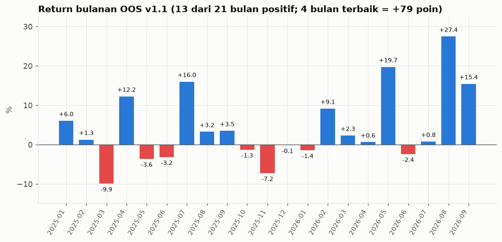

| | Jan | Feb | Mar | Apr | Mei | Jun | Jul | Agu | Sep | Okt | Nov | Des | Tahun |
|---|---|---|---|---|---|---|---|---|---|---|---|---|---|
| 2025 | +6,0 | +1,3 | −9,9 | +12,2 | −3,6 | −3,2 | +16,0 | +3,2 | +3,5 | −1,3 | −7,2 | −0,1 | **+14,8** |
| 2026 | −1,4 | +9,1 | +2,3 | +0,6 | +19,7 | −2,4 | +0,8 | +27,4 | +15,4 | | | | **+91,8** |

Per kuartal: 2025 Q1 −3,3 · Q2 +4,8 · Q3 +23,9 · Q4 −8,6 · 2026 Q1 +10,0 · Q2 +17,6 · **Q3 +48,2**. Empat bulan terbaik (Agu 2026, Mei 2026, Jul 2025, Sep 2026) menyumbang +78 poin; 17 bulan lainnya digabung jauh lebih kecil.

### 7.4 Kontribusi tiap mesin

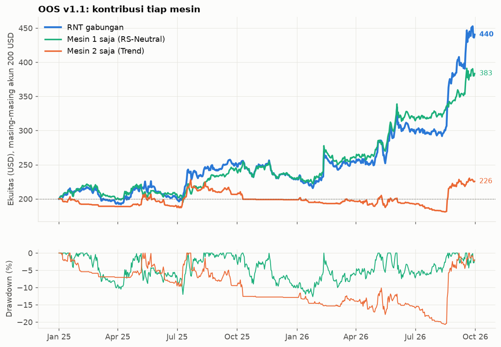

| OOS, akun 200 USD masing-masing | Akhir | Sharpe | Max DD | Underwater terlama | 2025 | 2026 | Bulan positif |
|---|---|---|---|---|---|---|---|
| **RNT (gabungan)** | **440** | **1,69** | −16,2% | 143 hari | +14,8% | +91,8% | 13/21 |
| Mesin 1 saja | 383 | 1,67 | −12,7% | 154 hari | +15,1% | +66,5% | 16/21 |
| Mesin 2 saja | 226 | 0,48 | −20,7% | **410 hari** | −0,6% | +13,5% | 7/21 |

Mesin 2 datar dari Mar 2025 sampai Jul 2026, lalu melonjak di Agu 2026 (+20,4% dalam sebulan) ketika tren terbentuk. Win rate-nya hanya 18% dengan profit factor 1,25: pola khas trend following.

### 7.5 Drawdown dan eksposur

Enam drawdown terdalam OOS:

| Mulai | Dasar | Pulih | Kedalaman | Lama |
|---|---|---|---|---|
| 20 Sep 2025 | 25 Jan 2026 | 11 Feb 2026 | **−16,2%** | 144 hari |
| 22 Mei 2025 | 4 Jul 2025 | 16 Jul 2025 | −13,2% | 55 hari |
| 3 Jun 2026 | 11 Agu 2026 | 19 Agu 2026 | −12,8% | 77 hari |
| 9 Mei 2026 | 16 Mei 2026 | 21 Mei 2026 | −11,7% | 12 hari |
| 13 Feb 2025 | 6 Apr 2025 | 7 Mei 2025 | −11,7% | 83 hari |
| 11 Feb 2026 | 5 Mar 2026 | 5 Mei 2026 | −9,9% | 83 hari |

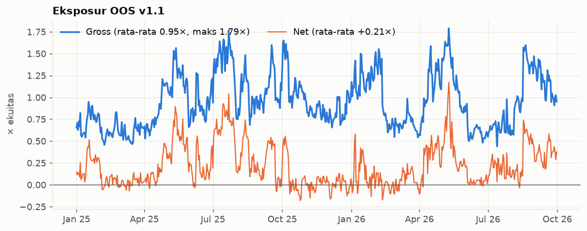

### 7.6 Statistik trade

| Metrik | OOS v1.1 |
|---|---|
| Jumlah order | 1.616 (77 per bulan, ±2,5 per hari) |
| Posisi selesai (buka → tutup) | **656** (31 per bulan); 14 posisi masih terbuka per 30 Sep 2026 |
| Lama pegang | median 7 hari, rata-rata 11,2 hari, persentil 90 = 26 hari |
| Win rate | **41,8%** (long 32,5%, short 52,8%) |
| Rata-rata untung / rugi per posisi | +2,73 / −1,65 USD (rasio 1,66) |
| Profit factor | 1,19 |
| PnL posisi selesai | **+119,5 USD** (long +7,7 · short +111,8) |
| PnL posisi terbuka | **+121,0 USD** (long +131,7 · short −10,8) |
| Total PnL (tertutup + terbuka) | +240,5 USD (long +139,4 · short +101,0) |

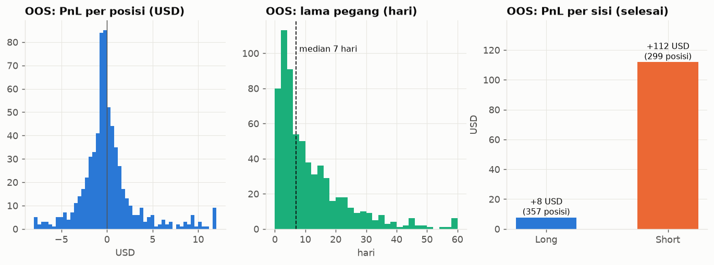

**Setengah profit OOS belum terealisasi.** Posisi terbuka per 30 Sep 2026 (nilai mark-to-market):

| Koin | Sisi | PnL (USD) | Ukuran posisi (USD) |
|---|---|---|---|
| ZEC | long | +48,6 | 45,6 |
| NEAR | long | +26,7 | 29,3 |
| ETH | long | +20,2 | 104,0 |
| UNI | long | +18,6 | 29,3 |
| ENA | long | +7,6 | 33,7 |
| SUI | long | +4,3 | 29,5 |
| SOL | long | +3,1 | 38,7 |
| BTC | long | +2,6 | 61,3 |
| XPL | short | +1,0 | 27,7 |
| XMR | short | +0,5 | 24,9 |
| PUMP | long | +0,1 | 27,7 |
| LIT | short | −0,1 | 19,8 |
| DOGE | short | −6,1 | 38,2 |
| XRP | short | −6,1 | 38,4 |

### 7.7 PnL per koin (posisi selesai + terbuka)

| 10 terbaik | USD | Posisi | 10 terburuk | USD | Posisi |
|---|---|---|---|---|---|
| ZEC | +56,6 | 6 | VIRTUAL | −22,4 | 3 |
| POPCAT | +27,9 | 10 | DOGE | −14,3 | 23 |
| ENA | +27,6 | 29 | TAO | −13,6 | 17 |
| kPEPE | +23,9 | 23 | ADA | −9,5 | 19 |
| BERA | +21,6 | 2 | IP | −8,1 | 4 |
| ETH | +21,1 | 32 | ONDO | −6,7 | 11 |
| NEAR | +19,9 | 11 | LDO | −6,3 | 8 |
| PENGU | +13,9 | 6 | MOODENG | −5,1 | 2 |
| HYPE | +13,8 | 35 | MKR | −5,0 | 6 |
| VVV | +13,4 | 5 | JUP | −4,8 | 3 |

Lima posisi tertutup terbaik: long BERA (7 Feb → 4 Mar 2026) +25,7 · long PUMP (16 Jul → 30 Agu 2026) +22,1 · long SOL (8 Agu → 15 Sep 2026) +20,8 · long ETH (2 Jul → 6 Sep 2025) +18,4 · long POPCAT (10 Apr → 14 Mei 2025) +18,4.
Lima terburuk: short UNI (14 → 29 Agu 2026) −12,2 · long VIRTUAL (1 Nov → 2 Des 2025) −12,0 · short FARTCOIN (9 → 22 Jul 2025) −9,2 · short SUI (18 → 23 Agu 2026) −8,5 · short XPL (23 → 25 Sep 2026) −8,1.

---

## 8. Hasil IS v1.1 (Jul 2020 → Des 2024)

Akun 200 USD, Binance + koin mati/kecil + **funding riil** (termasuk koin mati).

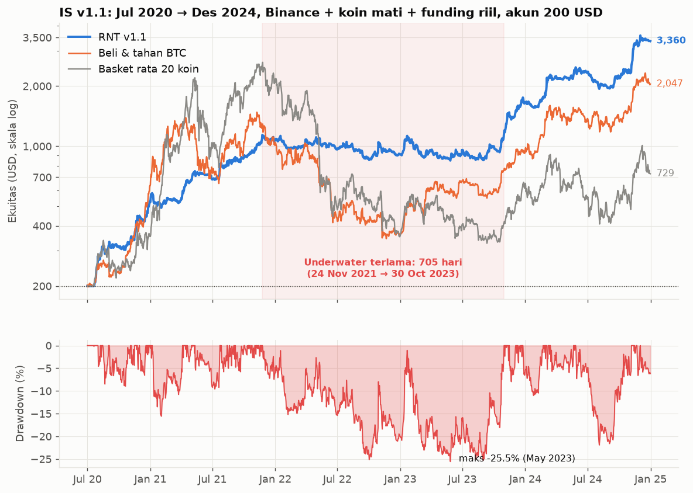

### 8.1 Angka utama

| Metrik | RNT | Mesin 1 saja | Mesin 2 saja | BTC beli-tahan |
|---|---|---|---|---|
| **200 USD menjadi** | **3.360** | 943 | 752 | 2.047 |
| CAGR | 87,0% | 41,1% | 34,2% | 67,6% |
| Volatilitas | 32,5% | 22,6% | 19,8% | 61,5% |
| **Sharpe** | **2,09** | 1,64 | 1,58 | 1,15 |
| Sortino | 3,69 | 2,68 | 2,75 | 1,73 |
| Max DD | −25,5% | −17,6% | −19,4% | −76,7% |
| Underwater terlama | **705 hari** | 558 hari | 785 hari | 846 hari |
| Bulan positif | 33/54 | 33/54 | 26/54 | 32/54 |

Tambahan RNT: t-stat 4,43; Calmar 3,41; rata-rata DD −4,9%; bulan terbaik Nov 2024 **+43,0%**, terburuk Jul 2024 **−11,4%**; hari terbaik +12,4% (29 Okt 2022), terburuk −5,4% (12 Mei 2022). Order 5.052 (93/bulan); posisi selesai 1.810 (33/bulan) + 11 terbuka (+137 USD); win rate 40,1%; profit factor 1,39; total fee 231,7 USD; **funding +39,9 USD diterima**. Gross rata-rata 0,87× (maks 2,15×), net rata-rata +0,21×.

### 8.2 Per tahun

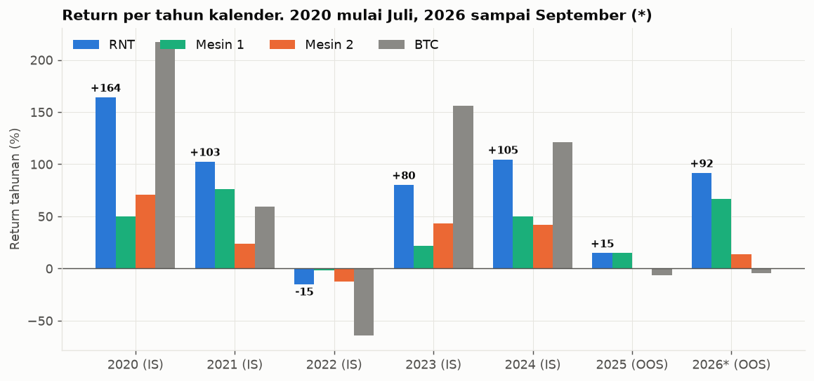

| | 2020 (Jul–Des) | 2021 | **2022** | 2023 | 2024 | 2025 (OOS) | 2026\* (OOS) |
|---|---|---|---|---|---|---|---|
| **RNT** | +164,2 | +102,5 | **−14,9** | +80,2 | +104,6 | +14,8 | +91,8 |
| Mesin 1 | +49,8 | +76,0 | −1,8 | +21,5 | +49,8 | +15,1 | +66,5 |
| Mesin 2 | +70,7 | +23,6 | −12,3 | +43,3 | +41,8 | −0,6 | +13,5 |
| BTC beli-tahan | +216,8 | +59,6 | −64,2 | +155,9 | +121,1 | −6,4 | −4,6 |

\* sampai 30 Sep 2026. Jujur soal pembanding: di 2020, 2023, dan 2024 beli & tahan BTC **menghasilkan lebih banyak** dari RNT; RNT menang dalam risiko (DD −26% vs −77%) dan di 2021–2022 serta OOS.

### 8.3 Return bulanan 2020–2026

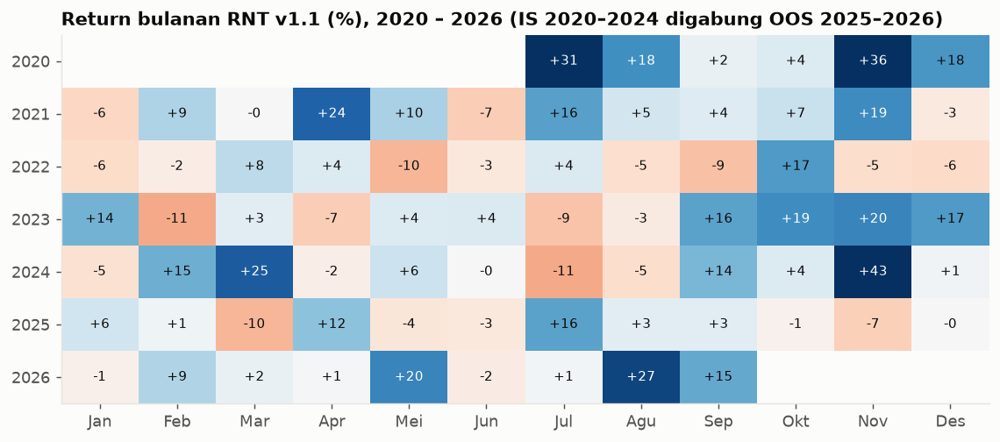

Per kuartal IS: 2020 Q3 +58,3 · Q4 +66,9 · 2021 Q1 +2,3 · Q2 +26,4 · Q3 +27,5 · Q4 +22,9 · 2022 Q1 −0,4 · Q2 −9,3 · Q3 −9,7 · Q4 +4,5 · 2023 Q1 +4,5 · Q2 +0,6 · Q3 +3,2 · **Q4 +66,2** · 2024 Q1 +36,6 · Q2 +4,2 · Q3 −4,5 · Q4 +50,5.

### 8.4 Drawdown terdalam IS

| Mulai | Dasar | Pulih | Kedalaman | Lama |
|---|---|---|---|---|
| 24 Nov 2021 | 27 Mei 2023 | 31 Okt 2023 | **−25,5%** | **706 hari** |
| 27 Mei 2024 | 4 Agu 2024 | 6 Nov 2024 | −21,9% | 163 hari |
| 6 Jan 2021 | 2 Feb 2021 | 5 Apr 2021 | −15,6% | 89 hari |
| 25 Des 2023 | 25 Jan 2024 | 22 Feb 2024 | −11,0% | 59 hari |
| 11 Mei 2021 | 8 Jul 2021 | 23 Jul 2021 | −9,6% | 73 hari |

**Masa datar Nov 2021 → Okt 2023 (±2 tahun):** ekuitas bergerak antara ±860 dan ±1.100 USD. Strategi ini menuntut kesabaran, dan inilah alasan alarm tidak boleh dipasang terlalu sensitif (§12).

### 8.5 Survivorship dan definisi umur/persentil (uji IS)

Uji survivorship memakai 579 perp Binance tambahan. Hasilnya menjaga edge:

| IS, akun 200 USD | Koin hidup saja | + koin mati/kecil (funding = 0) | + koin mati + **funding riil** |
|---|---|---|---|
| v1.0 | 3.241 (Sharpe 2,08, DD −26,4%) | 2.651 (Sharpe 1,94, DD −33,3%) | 3.359 (Sharpe 2,10, DD −25,9%) |
| **v1.1** | | | **3.360** (Sharpe 2,09, DD −25,5%) |

Replika kondisi "candle hantu" di IS (perp Binance diisi mundur dengan harga spot, volume 0; 79 koin, 18.293 hari-koin):

| Definisi | Koin hidup | + koin mati |
|---|---|---|
| Persentil antar semua koin (v1.0, tanpa candle hantu) | Sharpe 1,91 · akun 3.241 | Sharpe 1,91 · akun 2.651 |
| Persentil hanya top-20 | Sharpe 1,83 · 2.912 | Sharpe 1,84 · 2.500 |
| Dengan candle hantu, **umur = semua candle** (aturan v1.0) | Sharpe **1,72** · 2.224 | Sharpe 1,78 · 1.968 |
| Dengan candle hantu, **umur = hari nyata** (v1.1) | Sharpe **1,92** · 3.296 | Sharpe 1,96 · 2.618 |
| + persentil antar koin aktif (v1.1 penuh) | Sharpe 1,95 · 3.411 | Sharpe 1,93 · 2.614 |

(Angka akun dan Sharpe tabel ini dari r01; tidak memakai funding riil koin mati. Kesimpulan: aturan umur v1.0 merugikan di IS, sehingga diganti.)

---

## 9. Uji ketahanan

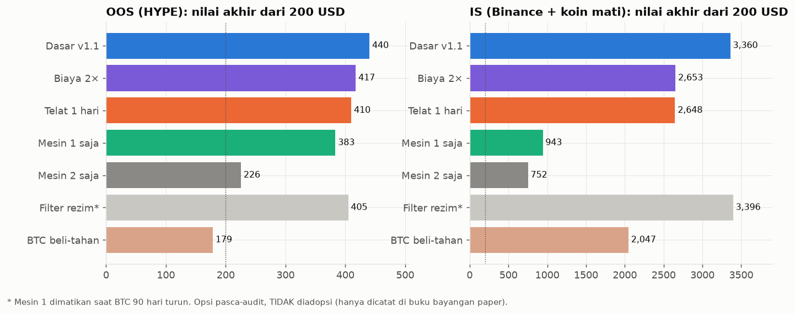

### 9.1 OOS (HYPE)

| Uji | 200 USD menjadi | Sharpe | Max DD |
|---|---|---|---|
| **Dasar v1.1** | **440** | **1,69** | −16,2% |
| Biaya 2× (0,15%/sisi) | 417 | 1,58 | −16,9% |
| Eksekusi telat 1 hari penuh | 410 | 1,56 | −20,5% |
| Hanya Mesin 1 | 383 | 1,67 | −12,7% |
| Hanya Mesin 2 | 226 | 0,48 | −20,7% |
| Filter rezim (opsi, tidak diadopsi) | 405 | 1,94 | −13,1% |
| Beli & tahan BTC | 179 | 0,07 | −53,0% |
| Tanggal akhir 31 Jul 2026 | **299** | — | — |

Eksekusi telat 15–60 menit hanya menurunkan hasil ±3–4% (audit pada v1.0: 499–506 vs 522 USD). Telat satu hari penuh setiap hari menurunkan hasil 440 → 410.

### 9.2 IS (dihitung ulang di `report_v11_data.py`; audit tidak menjalankan ini untuk IS)

| Uji | 200 USD menjadi | Sharpe | Max DD |
|---|---|---|---|
| **Dasar v1.1** | **3.360** | **2,09** | −25,5% |
| Biaya 2× | 2.653 | 1,93 | −31,7% |
| Eksekusi telat 1 hari | 2.648 | 2,00 | −29,0% |

### 9.3 Tetangga parameter (OOS, hanya dilaporkan, tidak dipakai memilih)

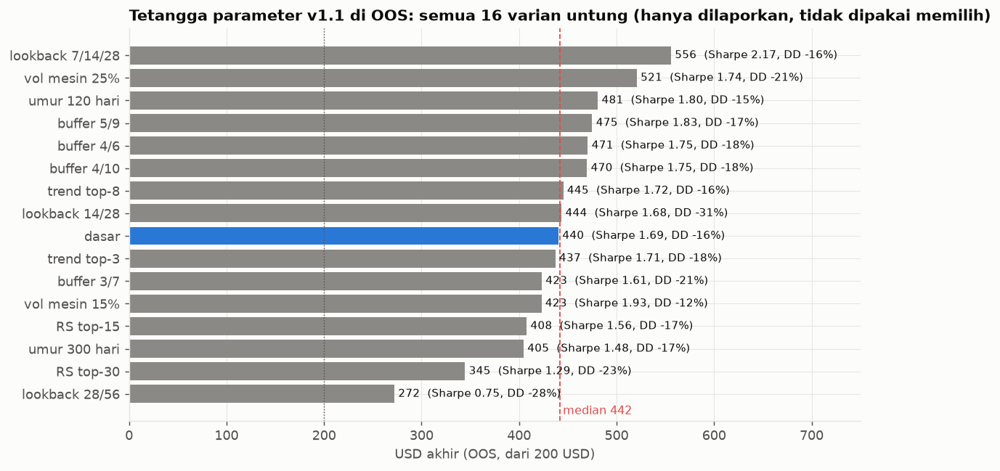

| Varian | OOS akhir | Sharpe OOS | DD OOS | Sharpe IS |
|---|---|---|---|---|
| **dasar** | **440** | 1,69 | −16,2% | 2,11 |
| buffer 3/7 | 423 | 1,61 | −20,6% | 1,98 |
| buffer 5/9 | 475 | 1,83 | −17,3% | 2,18 |
| buffer 4/6 | 471 | 1,75 | −17,8% | 1,96 |
| buffer 4/10 | 470 | 1,75 | −17,6% | 2,14 |
| lookback 14/28 | 444 | 1,68 | −30,5% | 1,99 |
| lookback 7/14/28 | 556 | 2,17 | −16,0% | 2,08 |
| lookback 28/56 | **272** | 0,75 | −28,4% | 1,80 |
| RS top-15 | 408 | 1,56 | −16,7% | 2,21 |
| RS top-30 | 345 | 1,29 | −23,2% | 2,03 |
| trend top-3 | 437 | 1,71 | −17,9% | 2,07 |
| trend top-8 | 445 | 1,72 | −16,3% | 1,98 |
| vol mesin 15% | 423 | 1,93 | −11,6% | 2,14 |
| vol mesin 25% | 521 | 1,74 | −21,4% | 2,10 |
| umur 120 hari | 481 | 1,80 | −14,9% | 2,01 |
| umur 300 hari | 405 | 1,48 | −16,6% | 1,74 |

**16 varian (dasar + 15 tetangga): semua untung, 272–556 USD, median 442.** Varian terlemah memakai lookback panjang saja (28/56). Audit menambahkan grid 60 varian (v1.0): **60/60 untung di OOS**, 55/60 punya Sharpe IS > 1, tetapi korelasi Sharpe IS vs OOS hanya 0,06. Artinya edge milik **keluarga strategi**, bukan milik parameter tertentu.

---

## 10. Karakter risiko: rezim, konsentrasi, distribusi

### 10.1 Rezim pasar: alpha pro-siklus

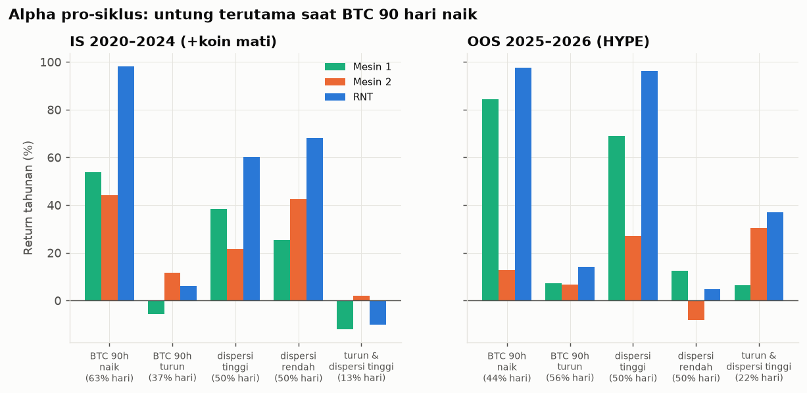

Return tahunan v1.1 menurut rezim (BTC 90 hari naik/turun; dispersi = dispersi return lintas koin di atas/bawah median):

| | IS: BTC 90h **naik** (63% hari) | IS: BTC 90h **turun** (37%) | OOS: BTC **naik** (44%) | OOS: BTC **turun** (56%) |
|---|---|---|---|---|
| **Mesin 1** | **+53,7%** (SR 2,29) | **−5,6%** (SR −0,28) | +84,3% (SR 3,68) | +7,2% (SR 0,31) |
| ↳ leg long / short | +54,1% / −0,4% | +13,1% / **−18,7%** | +59,1% / +25,2% | −24,3% / +31,5% |
| Mesin 2 | +44,1% | +11,7% | +12,8% | +6,7% |
| **RNT** | **+98,1%** (SR 2,71) | **+6,2%** (SR 0,24) | **+97,5%** (SR 3,18) | **+14,1%** (SR 0,49) |

| Dispersi | IS RNT | OOS RNT |
|---|---|---|
| Tinggi (50% hari) | +60,2% (SR 1,72) | **+96,2%** (SR 2,53) |
| Rendah (50% hari) | +68,2% (SR 2,23) | +4,6% (SR 0,26) |
| BTC turun **dan** dispersi tinggi | **−10,0%** (13% hari) | +37,0% (22% hari) |

Penjelasan: di pasar turun, rally tajam meremas leg short (pola *momentum crash* yang dikenal di literatur). Dispersi tinggi memang membantu di OOS, tetapi kombinasi "turun + dispersi tinggi" negatif di IS, sehingga klaim v1.0 tentang dispersi hanya setengah benar.

### 10.2 Konsentrasi profit

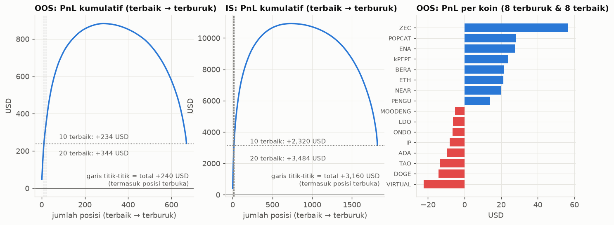

| | OOS v1.1 (HYPE) | IS v1.1 (+koin mati) |
|---|---|---|
| Jumlah posisi (termasuk terbuka) | 670 | 1.821 |
| PnL total | +240,5 USD | +3.159,5 USD |
| Bagian profit dari **5** posisi terbaik | **60%** | 47% |
| Bagian profit dari **10** posisi terbaik | **97%** | 73% |
| Tanpa 5 terbaik | +96,5 | +1.674,9 |
| Tanpa 10 terbaik | +6,8 | +840,0 |
| **Tanpa 20 terbaik** | **−103,2** | **−324,7** |
| Tanpa 20 terbaik **dan** 20 terburuk (simetris) | **+43,5** | **+751,3** |
| Rata-rata PnL per posisi setelah 3% ekor dibuang | +0,07 USD | −0,18 USD |
| Skewness | 3,9 | 6,9 |

- Uji "buang 20 terbaik" itu **asimetris**: membuang ekor kanan dari strategi positive-skew mana pun pasti membuatnya rugi. Jika dibuang simetris, hasilnya tetap positif.
- Tetapi risikonya nyata: **posisi "biasa" tidak punya edge**; seluruh edge ada di segelintir tren besar. Pola identik di IS (1.810 posisi), jadi ini sifat struktural. Jika pasar berhenti menghasilkan tren besar, strategi bocor pelan-pelan.
- Di IS: leg long untung +3.482 USD sementara leg short **rugi −323 USD** (posisi short tertutup: −514, win rate 43,6%). Di OOS (bear) kebalikannya: short +101, long +139 termasuk posisi terbuka (tertutup: short +112, long +8).
- Koin penyumbang IS: BTC +444, XRP +420, REEF +390 (hanya 4 posisi), SUI +371, DOGE +357, SOL +338, kPEPE +320, ETH +283, AXS +248, ADA +205. Terburuk: ORDI −156, TIA −153, DYDX −125, EOS −115, 1000RATS −113, PEOPLE −104, OP −98, LTC −68, CHZ −62, BOME −59.
- Posisi tertutup IS terbaik: long DOGE (16 Okt → 18 Des 2024) +411,6 · long SOL (29 Sep 2023 → 7 Jan 2024) +334,4 · long REEF (10 Sep → 15 Okt 2024) +265,0. Terburuk: short TIA (5 → 24 Nov 2024) **−143,8** (±5% ekuitas saat itu) · long PEOPLE (3 → 5 Jul 2024) −74,7 · short WLD (8 → 28 Nov 2024) −72,9.

### 10.3 Return bergulir (IS + OOS digabung, Jul 2021 → Sep 2026)

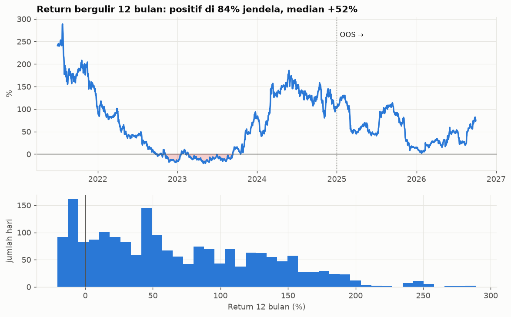

| Horizon | Jendela positif | Median | p10 → p90 | Terburuk |
|---|---|---|---|---|
| 90 hari | 72% | +9,1% | −7,6% → +49,1% | −22,4% |
| 180 hari | 78% | +20,0% | −7,4% → +80,0% | −21,2% |
| **12 bulan** | **84%** | **+52,4%** | −8,4% → +154,0% | −20,5% |
| 24 bulan | 99,9% | +131% | +27% → +305% | −1,3% |

Catatan: seri ini menyambung hasil IS (Binance) dengan OOS (HYPE). Jendela 12 bulan baru ada mulai Jul 2021 karena butuh riwayat 365 hari, sehingga tahun pertama yang sangat menguntungkan tidak ikut terhitung. Hasil bergulir 12 bulan yang negatif terjadi hampir seluruhnya dari akhir 2022 sampai pertengahan 2023.

---

## 11. Opsi yang dievaluasi tetapi tidak diadopsi: filter rezim

Mesin 1 dimatikan saat return BTC 90 hari ≤ 0:

| | Akun 200 USD | Sharpe | Max DD |
|---|---|---|---|
| IS v1.1 | 3.360 | 2,09 | −25,5% |
| IS + filter (Mesin 1 off) | 3.396 | **2,30** | −25,0% |
| OOS v1.1 | 440 | 1,69 | −16,2% |
| OOS + filter | 405 | **1,94** | −13,1% |
| OOS + filter separuh (ukuran Mesin 1 ×0,5 saat BTC turun) | 465 | 1,99 | −16,7% |
| IS + filter separuh | 3.582 | 2,27 | −24,3% |

Sharpe naik di kedua periode dan idenya punya dasar teori. **Tetapi filter ini lahir setelah membaca audit yang sudah melihat OOS**, sehingga mengadopsinya sama dengan menyesuaikan aturan ke data yang sudah diketahui. Keputusan: **v1.1 tetap versi utama; filter dicatat di buku bayangan `rf` (paper saja)** dan dievaluasi ulang dengan data forward test. Pada 2 hari pertama kedua buku identik karena BTC 90 hari sedang naik.

---

## 12. Ekspektasi 12 bulan dan sistem alarm

### 12.1 Ekspektasi (block bootstrap 30 hari, 4.000 jalur 12 bulan dari return v1.1 IS + OOS)

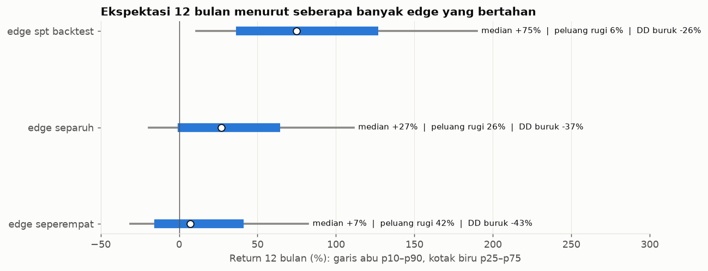

| Kalau edge-nya... | Median 12 bln | p10 → p90 | Peluang rugi | DD median / buruk (10%) |
|---|---|---|---|---|
| sama dengan backtest | +75% | +11% → +190% | 6% | −17% / −26% |
| **separuh (skenario dasar)** | **+27%** | −19% → +111% | **26%** | **−24% / −37%** |
| seperempat | +7% | −31% → +82% | 42% | −29% / −43% |

| Pernyataan | Audit | Penulis (setelah uji) |
|---|---|---|
| Angka laporan v1.0 benar dan tanpa manipulasi | 97% | 98% |
| Mesin 1 punya edge nyata | 60% | 60% |
| Untung dalam 12 bulan | 60% | 65–70% di skenario separuh; kira-kira lempar koin kalau BTC lesu |
| CAGR ≥ 25% | 25% | ±35–40% |
| Mengulang +73%/tahun | 10% | ≤10% |

**Angka yang jujur untuk direncanakan: median ±+25%/tahun, DD sampai −35%, masa datar bisa hampir 2 tahun.** Jangan perlakukan RNT sebagai diversifikasi untuk RMF (korelasi bulanan 0,59): satu kantong risiko.

### 12.2 Studi alarm

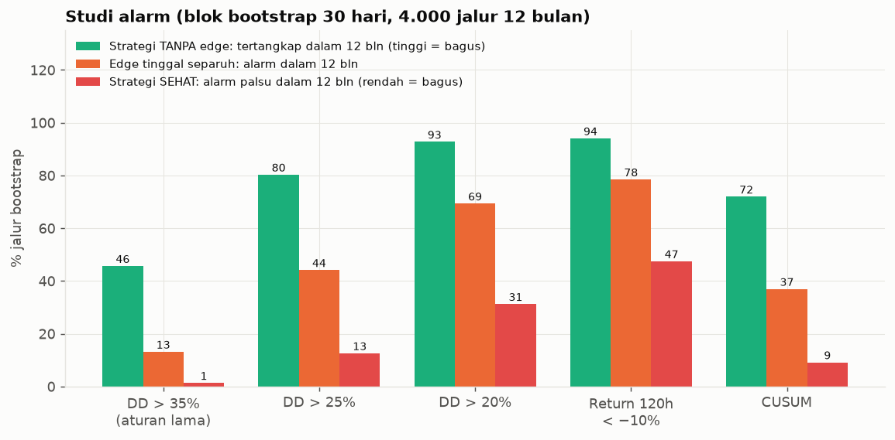

Peluang alarm berbunyi dalam 12 bulan (makin tinggi untuk "tanpa edge" makin bagus; makin rendah untuk "sehat" makin bagus):

| Aturan | Strategi **tanpa edge** | Edge **separuh** | Strategi **sehat** (alarm palsu) | Median hari sampai alarm (tanpa edge) |
|---|---|---|---|---|
| DD > 35% (aturan lama) | 46% | 13% | 1% | 234 |
| **DD > 25%** | **80%** | 44% | **13%** | 173 |
| DD > 20% | 93% | 69% | 31% | 128 |
| Return 90 hari < −12% | 95% | 81% | 50% | 118 |
| Return 120 hari < −10% | 94% | 78% | 47% | 133 |
| Return 180 hari < −5% | 90% | 70% | 37% | 179 |
| **CUSUM** (k = 31%/th, h = 0,45) | **72%** | 37% | **9%** | 208 |

Batasan jujur: edge yang tinggal separuh sangat sulit dibedakan dari strategi sehat dalam 12 bulan (alarm hanya 37–44%). Tidak ada aturan yang bisa sekaligus cepat dan jarang salah.

### 12.3 Alarm yang dipakai bot

| Level | Pemicu | Tindakan |
|---|---|---|
| **Teknis (bulanan)** | return live − paper bulan lalu > 3 poin ekuitas | Telegram: cari masalah eksekusi (bukan soal edge) |
| 🟡 **Kuning** | DD > 20% **atau** CUSUM > 0,45 | ukuran live × 0,5; lalu evaluasi |
| 🔴 **Merah** | DD > 25% | live hanya mengurangi/menutup posisi; keputusan berhenti di user |

DD dihitung dari ekuitas live bila live aktif, selain itu dari paper. Reset: `gh workflow run control.yml -f reset_breaker=true`.

---

## 13. Bot dan infrastruktur

### 13.1 Arsitektur

```
GitHub Actions (bot.yml)  watcher hidup ±5,5 jam, siklus tiap 10 menit
  └─ run_cycle.py
       └─ job harian: sekali per hari UTC (>= 00:02 UTC = 07:02 WIB)
            candle 1d semua perp HYPE (450 hari) -> target bobot (state/view.json)
            -> buku paper "paper" (v1.1) + "rf" (bayangan filter rezim, tidak diadopsi)
            -> alarm (DD 20/25% + CUSUM) -> [live: subaccount HYPE, hanya mode live/manage/flatten]
            -> Telegram (outbox) + log CSV di state/ (+ cermin Google Sheets)
  └─ tools/save_state.sh  commit state/ ke repo ([skip ci])
```

| Workflow | Fungsi | Jadwal |
|---|---|---|
| `bot.yml` | watcher + siklus harian | cron `11,41 * * * *` hanya sebagai pemicu cadangan; watcher menyalakan penggantinya sendiri (cron GitHub terukur hanya ±25% andal) |
| `watchdog.yml` | alarm + nyalakan watcher baru kalau state tidak diperbarui > 90 menit | cron `3,18,33,48 * * * *` |
| `control.yml` | ganti mode, reset breaker | manual (`gh workflow run`) |
| `canary.yml` | uji jalur order live (long + short ±10 USDC) sebelum live | manual |
| `smoke.yml` | cek Telegram, Sheets, kunci API wallet (hanya baca), data HYPE | manual |
| `ci.yml` (tests) | tes offline (gerbang) + cek konektivitas harian | tiap push + cron `17 6 * * *` |

### 13.2 Mode

| Mode (`control/bot.yaml`) | Paper | Live |
|---|---|---|
| `paper` (**sekarang**) | ✅ | — |
| `live` | ✅ | buka, tambah, kurangi, tutup, balik arah |
| `manage` | ✅ | hanya kurangi / tutup |
| `flatten` | ✅ | tutup semua posisi milik RNT |
| `off` | — | — |

### 13.3 Eksekusi live (belum aktif)

- Via SDK resmi HYPE; order market = IOC limit 1% menembus mid; cloid berawalan "RNT"; reduce-only untuk menutup; maks 6 percobaan live per hari.
- **Subaccount khusus RNT, margin cross, leverage 3×** (hanya batas margin; eksposur diatur ukuran order: gross rata-rata ±0,9×, maks 2,5×). Bot menolak jalan jika `account_address` = `master_address`, dan **berhenti (Halt)** jika ada posisi yang bukan dibuka RNT atau jika API wallet bot lain (MEX.bot, RMF.bot) terdaftar di akun RNT.
- Bot menolak jalan jika kunci di secret tidak menghasilkan `agent_address` di config. API wallet HYPE maks 180 hari; peringatan kedaluwarsa dikirim di sisa **14, 7, 3, 2, 1, dan 0 hari** (`AGENT_WARN_AT` di `run_cycle.py`).
- Paper memakai biaya sama dengan backtest (fee taker 0,045% + slippage 0,025%).

### 13.4 Paritas bot = riset

- `tools/parity_check.py` (di PC dengan data lake): bobot identik, akun OOS **440,45 USD = riset**, 1.616 order = riset.
- Satu beda yang disengaja: riset membuang koin yang *file*-nya < 30 candle (memakai panjang file total, termasuk masa depan). Bot tidak bisa tahu itu, jadi semua koin ikut; bobot tetap identik di data nyata.
- `tests/test_strategy_parity.py` membandingkan bot dengan `research/code` pada panel sintetis (termasuk candle hantu volume 0 dan koin baru listing).

### 13.5 Tes

**47 tes offline lulus** (dijalankan 2026-10-11 di PC lokal: `python -m pytest -q tests --ignore=tests/test_connectivity.py`; 8 detik). Cakupan: alarm, job harian, order live (dengan fake HYPE), rencana order + buku paper, paritas strategi, integritas repo. Workflow `tests` terakhir sukses (2026-10-10 12:37 UTC).

### 13.6 Telegram dan Google Sheets

Pesan harian (revisi 2026-10-10, commit `82af22c`): ringkas, berisi angka, tanpa CUSUM/target/skala/bayangan.

```
📊 RNT forward test · Paper · hari ke-N
<waktu UTC · candle <tanggal> · telat <n> menit>

📈 PnL: +x,x% · DD y,y%

Relative Strength Report
  🟢 Open Long Position: ETH (+10,0%) SOL (−1,0%) ...
  🔴 Open Short Position: DOGE (−9,0%) ...

Trend Report
  🟢 Open Long Position: BTC (+x,x%) ...        (atau "No Open Position")
```

- Persen di tiap koin = PnL posisi terhadap biaya masuk (fungsi `_coin_pnl` di `rntbot/jobs.py`). PnL dan DD memakai ekuitas live bila live punya riwayat, selain itu paper.
- Pesan live terpisah: `⚡ RNT live: <ekuitas> USDC (±x%) · order N` diikuti daftar order, yang dilewati, dan error.
- Peringatan API wallet kedaluwarsa: satu baris, hanya di sisa 14/7/3/2/1/0 hari. Peringatan "API wallet bot lain di akun utama": **sekali saja**.
- Yang juga dikirim: perubahan mode, perubahan level alarm, cek teknis bulanan, posisi live yang hilang di luar bot, error (maks 1× per 6 jam), watchdog. Pesan gagal disimpan di `state/outbox.json` dan dicoba ulang 48 jam.
- Google Sheets (cermin opsional, gagal menulis tidak pernah menggagalkan run): tab `equity`, `orders`, `positions`, `alarms`.

### 13.7 Status konfigurasi (per 2026-10-11)

| Komponen | Status |
|---|---|
| Repo GitHub + Actions | ✅ publik (`daijobudesu69/Crypto-RS-Neutral-Trend`); watcher berjalan (run terakhir 2026-10-11 02:11 UTC pending/berjalan, watchdog sukses) |
| Secret Telegram (`TELEGRAM_BOT_TOKEN`, `TELEGRAM_CHAT_ID`) | ✅ terisi (2026-10-10) |
| Secret Google Sheets (`GOOGLE_SERVICE_ACCOUNT_JSON`, `GSHEET_SPREADSHEET_ID`) | ✅ terisi (2026-10-10) |
| Secret kunci HYPE (`HYPE_RNT_AGENT_KEY_66_CHAR`) | ❌ belum; smoke test 2026-10-10 08:22 UTC **gagal hanya pada baris ini** (HYPE API, Sheets, Telegram semuanya OK) |
| `config.yaml → execution` (alamat master/subaccount/agent) | kosong |
| Canary → mode live | belum; ekspektasi user: paper sampai akhir Oktober 2026 |

> [!NOTE]
> Karena repo **publik**, isi `state/` (ekuitas, posisi, order) dapat dibaca siapa saja. Secret tetap aman.

---

## 14. Forward test: status per 2026-10-11

`forward_start` = 2026-10-10 (07:00 WIB). Mode **paper**, modal 200 USDC. Data dari `state/` (commit `59b0949`, 2026-10-11 02:07 UTC).

| Hari | Eksekusi (UTC) | Ekuitas paper | PnL vs 200 | DD | Gross | Net | Long / Short | Telat | Alarm |
|---|---|---|---|---|---|---|---|---|---|
| 1 | 2026-10-10 00:02 | 199,91 | −0,05% | −0,05% | 133,4 USD | +7,9 | 6 / 6 | 2,2 menit | ok |
| 2 | 2026-10-11 00:02 | **201,86** | **+0,93%** | −0,003% | 147,1 USD | +19,9 | 7 / 6 | 2,2 menit | ok |

(Ekuitas hari 1 = modal dikurangi fee masuk; DD hari 2 dihitung dari puncak 201,866; selisihnya hanya 0,007 USD.)

- **Posisi per 11 Okt 2026.** Long: ARB, BTC, ENA, NEAR, PUMP, SUI, WLD. Short: DOGE, ETH, LIT, VVV, XPL, XRP. Hari 1 membuka 12 posisi (6 long: BTC, ENA, NEAR, PUMP, SUI, WLD; 6 short: DOGE, ETH, LIT, VVV, XPL, XRP). Hari 2 menambah long ARB (naik ke peringkat 4 RS); target Trend untuk SOL/HYPE terlalu kecil (< 5 USD) sehingga tidak dibuka.
- Peringkat RS hari 2 (20 koin): NEAR 1, PUMP 2, SUI 3, ARB 4, BTC 5, WLD 6, ONDO 7, ENA 8 … XRP 16, ETH 17, VVV 18, XPL 19, DOGE 20. Universe Trend: BTC, ETH, HYPE, SOL, ZEC.
- Skala volatilitas mesin: k_RS 0,61 dan k_Trend 0,78; target gross 0,66× ekuitas, net +0,06×.
- Rezim: BTC 82.946 (return 90 hari **positif**), sehingga buku bayangan `rf` identik dengan buku utama.
- Alarm: level **ok**, CUSUM 0,0. Order tercatat: 26 baris di `orders.csv` (12 order buka hari 1 + 1 order buka hari 2, masing-masing untuk dua buku `paper` dan `rf`; tanpa order live).
- 2 hari tidak membuktikan apa pun; angka ini hanya mengonfirmasi bahwa pipeline (data → target → order paper → state → Telegram/Sheets) berjalan end-to-end. Kriteria evaluasi forward test: bandingkan dengan v1.1 backtest di hari yang sama, evaluasi filter rezim `rf`, dan pantau alarm.

---

## 15. Cross-check folder lokal vs GitHub

Dicek 2026-10-11.

| Cek | Hasil |
|---|---|
| Remote | `origin` = `https://github.com/daijobudesu69/Crypto-RS-Neutral-Trend.git`, publik, branch tunggal `main`; tidak ada PR atau issue |
| Posisi awal | lokal `82af22c` (**tertinggal 17 commit** `state: …` dari bot, 2026-10-10 10:22 → 2026-10-11 02:07 UTC); tidak ada commit lokal yang belum di-push; working tree bersih |
| Tindakan | `git pull --ff-only` (hanya `state/*` yang berubah: `paper.json`, `view.json`, `equity.csv`, `orders.csv`, `runs.csv`, `targets.csv`, `alerts.json`). Sekarang lokal = `origin/main` = `59b0949` |
| Berkas terlacak | **142** di lokal dan **142** di `origin/main` (identik) |
| File kode/riset/dokumen | identik; satu-satunya perbedaan antara lokal dan GitHub tadi adalah `state/` |
| Tes | 47 lulus lokal; workflow `tests` di GitHub lulus (push `82af22c` dan cron harian) |
| Secret GitHub | 4 terisi (Telegram ×2, Google Sheets ×2); kunci HYPE belum |
| **Hanya lokal (gitignored, disengaja)** | `research/data/` **34 MB** (candle koin delist HYPE + perp Binance di luar data lake + funding riil), `research/results/cache/` **218 MB** (panel pickle), paket sementara audit `research/audit_2026-10-09/_*` (±20 MB; aman dihapus). Data lake sumber ada di luar repo (`C:\Crypto data\backtest data and more`). Akibatnya, **tes paritas data nyata dan `report_v11_data.py` hanya bisa jalan di PC ini**; `report_v11_charts.py` dan tes biasa jalan di mana saja |
| Ketidaksesuaian yang ditemukan | (1) Grafik lama `charts/oos_equity_200usd.png`, `oos_engines.png`, `oos_monthly.png`, `is_equity_200usd.png`, `oos_v10_vs_v11.png` masih berlabel **"DUET"** dan memuat angka v1.0 (522 USD); laporan ini tidak lagi memakainya (diganti `charts/v11_*.png`), tetapi berkasnya masih ada. (2) `research/audit_2026-10-09/README.md` masih menyebut "DUET". (3) Catatan memori sesi lama menyebut revisi pesan Telegram "belum diterapkan", padahal sudah masuk di commit `82af22c` |
| Perubahan baru dari sesi ini (belum di-commit) | `research/PROJECT CRYPTO - RNT.md` (laporan ini), `research/README.md`, `CHANGELOG.md`, `research/code/report_v11_data.py`, `research/code/report_v11_charts.py`, `research/charts/v11_*.png` (16 file), `research/results/v11_*.csv`, `v11_report_stats.json` |

---

## 16. Risiko, keterbatasan, dan yang belum pasti

- **OOS tidak lagi murni.** v1.1 dibuat setelah OOS dilihat; 21 bulan OOS dengan t-stat 2,23 tetap pendek. ±290 konfigurasi diuji di IS; OOS, tetangga parameter, dan uji survivorship mengurangi tetapi tidak menghapus risiko overfit.
- **Rezim.** Alpha Mesin 1 pro-siklus; bear market + rally tajam meremas leg short. Hasil terbaik terjadi saat BTC naik. Filter rezim belum diadopsi.
- **Konsentrasi ekor.** Tanpa 20 posisi terbaik hasil negatif; "trade biasa" tidak punya edge. Jika tren besar menghilang, strategi bocor pelan-pelan.
- **Masa datar panjang.** IS: 705 hari underwater (Nov 2021 → Okt 2023). Mesin 2 di OOS: 410 hari underwater.
- **Hasil bergantung tanggal akhir dan posisi terbuka.** 299 USD (31 Jul) vs 440 USD (30 Sep); 121 dari 240 USD profit belum terealisasi.
- **Short squeeze.** Candle harian menyembunyikan wick intraday. OOS: tidak ada posisi yang bergerak >100% melawan (maks +69%). IS: rugi terburuk short TIA Nov 2024 (−144 USD, ±5% ekuitas) dan long LUNA Mei 2022.
- **Eksekusi harus tepat waktu.** Telat sehari penuh: 440 → 410 USD (OOS) dan 3.360 → 2.648 (IS). Telat 10–30 menit tidak masalah.
- **Order minimum 10 USD.** Di 200 USD banyak posisi 10–25 USD; pembulatan memengaruhi ukuran (sudah disimulasikan). Menaikkan modal ke ≥500 USD tidak mengubah hasil secara berarti (audit v1.0: 492 vs 522 USD).
- **Perilaku API HYPE ke depan.** Candle pra-listing (±999 hari, volume 0) masih dikirim; v1.1 tidak bergantung padanya.
- **Data.** 15 koin kecil OOS tidak ada di Binance (4,5% posisi); funding koin mati hanya dari 70 koin (BLZ ±1/3 dari total).
- **Hipotesis sampingan** (jam, hari, gap CME) tidak diuji ulang audit dan tidak memengaruhi strategi.
- **Operasional:** repo publik membuka isi `state/`; cron GitHub tidak andal (diatasi watcher + watchdog); API wallet maks 180 hari; satu koin hanya satu posisi per akun sehingga wajib subaccount khusus; RNT dan RMF dianggap satu kantong risiko.

---

## 17. Peta file dan cara mereproduksi

```
Crypto-RS-Neutral & Trend/
  README.md, CHANGELOG.md, config.yaml, control/bot.yaml
  run_cycle.py, run_status.py, run_watchdog.py, run_canary.py
  rntbot/            strategy.py, plan.py, book.py, live.py, alarms.py, jobs.py, hype.py,
                     notify.py, sheets.py, store.py, control.py, canary.py, config.py
  tests/             47 tes offline (alarm, jobs, live, plan/book, paritas, repo)
  tools/             save_state.sh, refresh_state.sh, save_control.sh, set_control.py,
                     check_live.py, smoke_test.py, parity_check.py
  docs/              SETUP.md, apps_script.gs
  state/             log forward test (equity, orders, targets, runs, alarms, paper.json, view.json, ...)
  .github/workflows/ bot, watchdog, control, canary, smoke, ci
  research/
    PROJECT CRYPTO - RNT.md      <- laporan ini
    SPEC_FROZEN.md               spesifikasi v1.0, dikunci sebelum OOS
    SPEC_v1.1.md                 spesifikasi berlaku (13 langkah)
    audit_2026-10-09/            audit independen (dq.py, t01–t20, out_*.csv)
    audit_response/              respons audit: AUDIT_RESPONSE.md, r01–r07, v11_*_daily.csv, v11_oos_trips.csv, r05_v11.json
    code/                        lab.py, strat.py, rnt.py, account.py, explore1–6, oos.py, survivorship_is.py,
                                 fetch_delisted.py, report_data.py (v1.0), report_v11_data.py, report_v11_charts.py
    results/                     tabel hasil: stage*_is.csv, oos_*.csv, *.json (v1.0);
                                 v11_series_{oos,is}.csv, v11_is_trips.csv, v11_coin_pnl_{oos,is}.csv, v11_report_stats.json
    charts/                      v11_*.png (laporan ini); grafik lama berlabel DUET/v1.0: oos_*.png, is_equity_200usd.png
    data/ (lokal saja)           56 perp HYPE delist, 579 perp Binance di luar data lake, funding riil 70 koin mati
```

### Mereproduksi

| Tujuan | Perintah | Syarat |
|---|---|---|
| Angka OOS/IS v1.1 + seri harian | `python research/code/report_v11_data.py` | data lake + `research/results/cache` (PC riset); ±40 detik |
| Grafik dan statistik laporan | `python research/code/report_v11_charts.py` | hanya CSV di repo; butuh `pandas`, `numpy`, `matplotlib` |
| Audit v1.1 lengkap (tetangga, filter rezim) | `python research/audit_response/r05_v11_full.py` | PC riset; menulis `r05_v11.json` |
| Target bobot hari ini | `python run_status.py` | internet (±6–7 menit); tidak mengubah state |
| Tes bot | `python -m pytest -q tests --ignore=tests/test_connectivity.py` | — |
| Paritas bot vs riset di data nyata | `python tools/parity_check.py` | PC riset |

Skrip riset tidak mengubah parameter. Mengubah `config.yaml → strategy/rules` memutus keterbandingan forward test dengan backtest; catat di [CHANGELOG.md](../CHANGELOG.md).

---

*Laporan ini hasil riset, bukan nasihat investasi. Semua angka backtest memakai data historis dan tidak menjamin hasil di masa depan.*
