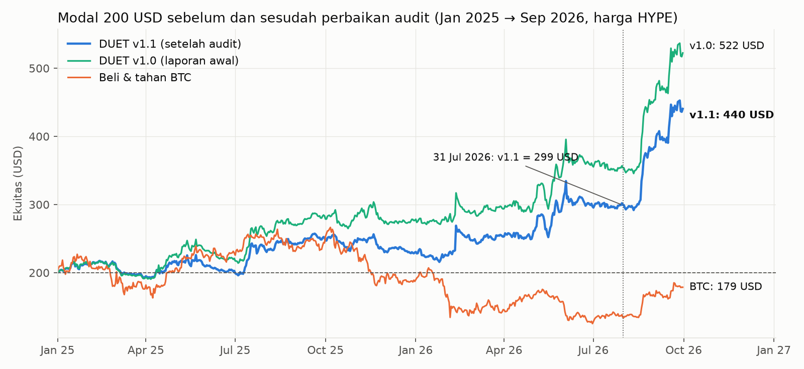

# Respons atas Audit RNT (2026-10-09)

*Penulis strategi menjawab audit. Setiap putusan di bawah didukung uji data; skripnya ada di folder ini (`r01`–`r07`).*

## Ringkasan

**Audit ini sebagian besar benar, dan angka utama saya turun.** Setelah perbaikan, 200 USD menjadi **440 USD** (v1.1), bukan 522. Dari 18 temuan:

| Putusan | Jumlah | Temuan |
|---|---|---|
| **Setuju** | 12 | #1, #4, #5, #6, #7, #8, #11, #12, #13, #14, Baru-1, Baru-2 |
| **Setuju, dengan data tambahan** | 3 | #2 umur koin, #9 konsentrasi, Baru-4 pemilihan parameter |
| **Sebagian dibantah** | 2 | #3 OOS sekali jalan, Baru-3 cakupan persentil |
| **Dibantah dengan data** | 1 | #10 funding koin mati |

Tiga hal yang mengubah gambaran:

1. **Aturan umur koin memang cacat** (#2). Saya cek ke API HYPE: API **masih mengirim ±999 candle pra-listing** (harga identik dengan Binance, korelasi 1,0000, volume 0). Jadi perilaku v1.0 bisa direplikasi bot live dan bukan transaksi mustahil. Tetapi perilaku itu tidak pernah diuji di IS. Saat saya replika di IS, aturan v1.0 **merugikan** (Sharpe 1,72 vs 1,92). → Diperbaiki di v1.1.
2. **Klaim saya bahwa Mesin 1 "bekerja di pasar turun" salah** (#13 dan Baru-1). Di IS, Mesin 1 rugi −7%/tahun saat BTC 90 hari turun.
3. **Funding koin mati bukan biaya, melainkan pemasukan** (#10, dibantah). Dengan data funding riil dari arsip Binance untuk 70 koin, strategi **menerima** +5,4%/tahun. Akun IS jadi 3.360 USD, bukan 1.983–2.314.

---

## 1. Putusan per temuan

### #2 Umur koin — setuju, dengan bukti tambahan

| Uji | Hasil |
|---|---|
| Asal candle hantu | Diambil langsung dari API HYPE (`candleSnapshot` 1d), bukan dari seed MEX. Dicek ulang hari ini: XMR, ZEC, dan AXS masing-masing punya **999** candle volume 0 sebelum listing nyata (ZEC: 2 Okt 2025) |
| Isi candle hantu | Harga identik dengan perp Binance: korelasi return 1,0000, selisih median 0,00% (ZEC, XMR, LINK, DOT, ICP, DASH) |
| Bisa direplikasi live? | **Ya.** Bot yang mengikuti v1.0 secara harfiah akan membeli ZEC 8 hari setelah listing, sama seperti backtest. Pertanyaan audit "apakah bursa memberi riwayat sejak hari pertama" terjawab: ya, ±999 hari ke belakang |
| Apakah aturan itu didukung IS? | **Tidak.** Saya replika di IS: harga perp Binance sebelum listing diisi dengan harga spot Binance (volume 0, 79 koin, 18.293 hari-koin). Hasilnya: aturan v1.0 Sharpe **1,72** (akun 2.224), umur dari hari nyata Sharpe **1,92** (akun 3.296). Dengan koin mati: 1,78 vs **1,96** |
| Putusan | Tambahan +76 USD di OOS v1.0 (dari ZEC) adalah keberuntungan. Di IS, mekanisme yang sama merugikan. **v1.1: umur = hari dengan volume > 0 di HYPE** |

### #3 OOS dijalankan sekali — sebagian dibantah

Urutan dari transkrip sesi (setiap pemanggilan alat tercatat):
1. Tahap 1–6 dan pemilihan band: hanya metrik 2020-07 → 2024-12.
2. **Sebelum spesifikasi dikunci, data periode 2025+ disentuh dua kali, keduanya tanpa PnL strategi:**
   - (a) korelasi return harian Binance vs HYPE di 2025+ (0,9998);
   - (b) daftar koin delist yang pernah masuk top-20 di Des 2024 – Sep 2026 (FTM, IP, MKR, OM, TON), untuk menentukan funding mana yang perlu diunduh.

   Akses file HYPE pukul 01:14 WIB yang dicatat audit berasal dari dua langkah ini.
3. `SPEC_FROZEN.md` ditulis, lalu `oos.py` dijalankan. Itulah perhitungan PnL OOS pertama.
4. Sesudahnya ada uji stres, tetangga parameter, dan konsentrasi. Semuanya dilaporkan, dan parameter tidak diubah.

Audit benar bahwa **file** tidak bisa membuktikan ini. Buktinya adalah **transkrip sesi**, yang memuat setiap perintah beserta urutannya. Transkrip sudah diekspor ke `C:\Users\sedan\Downloads\session-export-1791503841284.zip` (6 MB). Cari penulisan `SPEC_FROZEN.md`, lalu `oos.py`: itulah perintah pertama yang mencetak PnL 2025–2026. Satu hal saya akui: v1.1 dibuat setelah OOS dilihat, jadi angka OOS v1.1 **bukan lagi out-of-sample murni**.

### #9 Konsentrasi — setuju; artinya lebih luas dari yang ditulis

| | OOS v1.0 | OOS v1.1 | IS v1.1 (+koin mati) |
|---|---|---|---|
| Bagian profit dari 5 posisi terbaik | 50% | 60% | 47% |
| Bagian dari 10 posisi terbaik | 81% | 97% | 73% |
| Tanpa 20 terbaik | −83 USD | −103 USD | −325 USD |
| **Tanpa 20 terbaik DAN 20 terburuk** | **+75 USD** | **+44 USD** | **+751 USD** |
| Rata-rata posisi setelah 3% ekor dibuang | +0,13 USD | +0,07 USD | −0,18 USD |

- Uji "buang 20 terbaik" itu asimetris. Membuang ekor kanan dari strategi positive-skew mana pun pasti membuatnya rugi. Kalau dibuang simetris, hasilnya tetap positif.
- Tetapi audit menunjuk risiko yang nyata: **trade "biasa" tidak punya edge.** Seluruh edge ada di segelintir tren besar, dan pola ini sama di IS (1.810 posisi). Jadi ini sifat struktural, bukan kebetulan OOS.
- Konsekuensinya: kalau pasar berhenti menghasilkan tren besar, strategi bocor pelan-pelan.

### #10 Funding koin mati — **dibantah dengan data riil**

Audit memakai **penalti asumsi** 0,05–0,1%/hari. Saya mengunduh funding **riil** dari `data.binance.vision` (futures/um/monthly/fundingRate) untuk ke-70 koin mati/kecil yang pernah dipegang strategi.

| Cek data | Hasil |
|---|---|
| Arsip vs data lake (BTC Mar 2023) | 93/93 baris identik, selisih 0,0 |
| LUNA 8–13 Mei 2022 | Funding turun sampai −1%/8 jam, sesuai sejarah crash |
| **Funding koin mati bagi strategi** | **+5,4%/tahun diterima, bukan dibayar.** Sebagian besar diterima di posisi long: koin yang sedang di-squeeze punya funding sangat negatif (BLZ, REEF, LINA, UNFI) |
| **Akun IS v1.0** | **3.359 USD**, Sharpe 2,10, DD −25,9%. Bandingkan dengan funding=0 (2.651) dan penalti audit (1.983–2.314) |

Catatan jujur: pemasukan ini juga terkonsentrasi. BLZ saja menyumbang ±1/3 dari total funding koin mati.

### #13 dan Baru-1 Rezim pasar — setuju; klaim saya salah

Return tahunan (versi bobot, v1.1):

| | IS + koin mati: BTC 90h naik | IS + koin mati: BTC 90h turun | OOS: BTC 90h naik | OOS: BTC 90h turun |
|---|---|---|---|---|
| Bagian hari | 63% | 37% | 44% | 56% |
| **Mesin 1 (RS)** | **+54%** (SR 2,29) | **−6%** (SR −0,28) | +84% (SR 3,68) | +7% (SR 0,31) |
| Mesin 1, leg long / leg short | +54% / −0% | +13% / **−19%** | +59% / +25% | −24% / +32% |
| Mesin 2 (Trend) | +44% | +12% | +13% | +7% |
| RNT | +98% | +6% | +98% | +14% |

- Beta Mesin 1 memang netral, tetapi **alpha-nya pro-siklus**. Di bear market, rally tajam meremas leg short (pola *momentum crash* yang dikenal di literatur).
- Klaim saya tentang dispersi hanya setengah benar. Dispersi tinggi memang membantu (IS Sharpe 1,57 vs 1,28; OOS 2,42 vs 0,77). Tetapi kombinasi "turun + dispersi tinggi", yang saya sebut ideal, **negatif di IS** (−12%/tahun).

### Baru-2 Underwater terpanjang — setuju

| Akun IS 200 USD | Underwater terpanjang |
|---|---|
| v1.0, koin hidup (angka di laporan lama) | 338 hari |
| v1.0, + koin mati | **715 hari** (25 Nov 2021 → 9 Nov 2023) |
| v1.1, + koin mati + funding riil | **705 hari** |

Laporan lama mengutip versi yang paling menguntungkan. Itu salah pilih angka.

### Baru-3 Cakupan persentil — sebagian dibantah

Kedua tafsir memang sah, dan rumusnya memang harus ditulis eksplisit (sudah, di [SPEC_v1.1.md](../SPEC_v1.1.md)). Tetapi **IS tidak mendukung versi "hanya top-20"**:

| IS | Persentil antar semua koin (v1.0) | Hanya top-20 |
|---|---|---|
| Koin hidup | **1,91** | 1,83 |
| + koin mati | **1,91** | 1,84 |

Jadi 424 USD bukan pembanding yang tepat untuk "versi wajar". v1.1 memakai persentil antar **koin yang benar-benar diperdagangkan hari itu**. Versi ini netral di IS (1,92 → 1,95) dan menghapus pengaruh candle hantu.

### Baru-4 Pemilihan parameter — setuju; klaim "dataran" saya salah

- Grid 60 varian milik audit: korelasi Sharpe IS vs OOS **0,06** (Spearman 0,01). 10 varian terbaik di IS punya median OOS 377 USD, bahkan di bawah median semua varian (387).
- **Parameter saya peringkat 1 dari 60 di IS** menurut ukuran audit. Klaim saya "dipilih dari tengah dataran, bukan puncak" tidak tepat.
- Yang tetap benar: 55/60 varian Sharpe IS > 1, dan **60/60 untung di OOS**. Edge-nya milik keluarga strategi, bukan milik parameter tertentu. **Ekspektasi yang jujur = median keluarga, bukan varian terpilih.**

### Temuan lain

| # | Putusan | Catatan |
|---|---|---|
| 1 | Setuju | — |
| 4 | Setuju | v1.1 per 31 Jul 2026 = **299 USD**. Agu–Sep 2026 menambah +47%. Dari profit 240 USD, **121 USD masih posisi terbuka** |
| 5 | Setuju | t-stat OOS v1.1 2,23 (v1.0: 2,71). 21 bulan memang pendek |
| 6, 7 | Setuju (audit sendiri membantah dugaan awalnya) | Telat 15–60 menit aman. Telat sehari setiap hari: v1.1 410 USD |
| 8 | Setuju | v1.1 Mesin 2 sendirian: 200 → 226 |
| 11 | Setuju | — |
| 12 | Setuju (tidak saya uji ulang) | Korelasi bulanan 0,59 dengan RMF. Perlakukan RNT + RMF sebagai **satu kantong risiko**, jangan dihitung sebagai diversifikasi |
| 14 | Setuju | Lihat alarm baru di bawah |

---

## 2. Perbaikan yang dilakukan

1. **[SPEC_v1.1.md](../SPEC_v1.1.md):** 13 langkah rumus eksplisit. Mencakup umur dari hari trading nyata, cakupan persentil, definisi quote volume, jendela min/max channel, dan penskalaan.
2. **Kode:**
   - `rnt.py` dapat opsi `age_mode` dan `pct_scope`. Default tetap v1.0, supaya angka lama bisa direproduksi.
   - v1.1 = `age_mode="real"`, `pct_scope="traded"`.
   - Validasi: dengan opsi yang sama, kode saya menghasilkan angka yang sama dengan `dq.py` milik audit (440,5 vs 440,5).
3. **Data:** funding riil 70 koin mati/kecil Binance, di `data/bn_dead/funding/`.
4. **Laporan:** [PROJECT CRYPTO - RNT.md](../PROJECT CRYPTO - RNT.md) diberi bagian pembaruan di atas. Klaim yang salah (pasar turun, 338 hari, dataran parameter, ekspektasi) dikoreksi di tempatnya.
5. **Alarm baru**, menggantikan "stop di DD 35%" (lihat §4).

## 3. Angka RNT v1.1

| | OOS HYPE Jan 2025 → Sep 2026 *(tidak murni lagi)* | IS Binance + koin mati + funding riil |
|---|---|---|
| **200 USD menjadi** | **440 USD** | 3.360 USD |
| Per tahun | 2025 **+15%**, 2026 (Jan–Sep) **+92%** | 2020 +164, 2021 +103, **2022 −15**, 2023 +80, 2024 +105% |
| Sharpe / Sortino / Calmar | 1,69 / 2,95 / 3,53 | 2,09 / 3,69 / 3,41 |
| Max DD / rata-rata DD | −16,2% / −6,7% | −25,5% / −4,9% |
| Underwater terlama | 143 hari | **705 hari** |
| Bulan positif | 13 dari 21 | 33 dari 54 |
| Order / posisi selesai per bulan | 77 / 31 | 93 / 33 |
| Win rate / profit factor | 42% / 1,19 | 40% / 1,39 |
| Mesin 1 saja / Mesin 2 saja | 383 / 226 | 943 / 752 |
| Biaya 2× / telat 1 hari | 417 / 410 | — |

**Tetangga parameter OOS v1.1** (16 varian): **semua untung**, 272–556 USD, median **442**, Sharpe IS 1,74–2,21. Varian terlemah adalah lookback 28/56 (272).

**Nilai v1.1 per tanggal:**

| 30 Jun 25 | 31 Des 25 | 31 Mar 26 | 30 Jun 26 | 31 Jul 26 | 31 Agu 26 | 30 Sep 26 |
|---|---|---|---|---|---|---|
| 203 | 230 | 253 | 297 | 299 | 382 | 440 |

### Opsi yang dievaluasi tetapi TIDAK diadopsi: Mesin 1 dimatikan saat BTC 90 hari turun

| | Akun 200 USD | Sharpe | Max DD |
|---|---|---|---|
| IS v1.1 | 3.360 | 2,09 | −25,5% |
| IS + filter (Mesin 1 off) | 3.396 | **2,30** | −25,0% |
| OOS v1.1 | 440 | 1,69 | −16,2% |
| OOS + filter | 405 | **1,94** | −13,1% |

- Sharpe naik di kedua periode, dan idenya punya dasar teori (momentum crash).
- **Tetapi filter ini lahir setelah membaca audit yang sudah melihat OOS.** Mengadopsinya sekarang sama dengan menyesuaikan aturan ke data yang sudah diketahui.
- Saran: jalankan v1.1 sebagai versi utama. Catat filter ini di **paper** selama forward test, lalu putuskan berdasarkan data baru.

## 4. Alarm baru

Diuji dengan block bootstrap (blok 30 hari, 4.000 jalur 12 bulan) dari return harian v1.1 (IS + OOS).

| Aturan | Strategi **tanpa edge** tertangkap dalam 12 bln | median hari | Strategi **sehat** (edge = backtest) alarm palsu 12 bln | **Edge separuh** alarm 12 bln |
|---|---|---|---|---|
| DD > 35% (lama) | 46% | 234 | 1% | 13% |
| **DD > 25%** | **80%** | **173** | **13%** | 44% |
| DD > 20% | 93% | 128 | 31% | 69% |
| Return 120 hari < −10% | 94% | 133 | 47% | 78% |
| **CUSUM** (k = 31%/th, h = 0,45) | **72%** | 208 | **9%** | 37% |

**Aturan yang saya usulkan:**

| Level | Pemicu | Tindakan |
|---|---|---|
| **Teknis (bulanan)** | Hasil live menyimpang > 3% ekuitas dari backtest **di hari yang sama** (bot menjalankan simulasi bayangan dengan harga yang sama) | Stop dan cari bug. Ini bukan soal edge, melainkan soal eksekusi |
| **Kuning** | DD > 20% **atau** CUSUM berbunyi | Ukuran posisi dipotong separuh, lalu evaluasi |
| **Merah** | DD > 25% | Stop. Lanjut hanya dengan bukti baru |

Batasannya jujur: strategi yang edge-nya tinggal **separuh** sangat sulit dibedakan dari strategi sehat dalam 12 bulan (alarm hanya 37–44%). Tidak ada aturan yang bisa cepat sekaligus jarang salah.

## 5. Ekspektasi dan keyakinan (revisi)

Bootstrap 12 bulan dari return v1.1:

| Kalau edge-nya... | Median 12 bln | p10 → p90 | Peluang rugi | DD median / buruk (10%) |
|---|---|---|---|---|
| sama dengan backtest | +75% | +11% → +190% | 6% | −17% / −26% |
| **separuh (skenario dasar)** | **+27%** | −19% → +111% | **26%** | **−24% / −37%** |
| seperempat | +7% | −31% → +82% | 42% | −29% / −43% |

| Pernyataan | Audit | Saya (setelah uji) |
|---|---|---|
| Angka laporan v1.0 benar dan tanpa manipulasi | 97% | 98%: setiap langkah tercatat di transkrip |
| Mesin 1 punya edge nyata | 60% | **60%**: IS + OOS + dua bursa + 60/60 varian, tapi pro-siklus dan bergantung pada ekor |
| Untung dalam 12 bulan | 60% | **65–70%** di skenario separuh, dan kira-kira lempar koin kalau BTC lesu |
| CAGR ≥ 25% | 25% | **±35–40%** |
| Mengulang +73%/tahun | 10% | **≤10%** |

**Kesimpulan:**
- RNT layak di-forward-test dengan uang kecil, di subaccount terpisah, dengan alarm baru.
- Jangan perlakukan strategi ini sebagai diversifikasi untuk RMF.
- Jangan berharap +161%. Angka yang jujur untuk direncanakan adalah **median ±+25%/tahun, DD sampai −35%, dan masa datar bisa hampir 2 tahun.**

## 6. Yang tetap tidak bisa dipastikan

- Perilaku API HYPE ke depan: apakah candle pra-listing tetap dikirim. v1.1 tidak bergantung pada candle ini.
- Hipotesis sampingan (jam, hari, gap CME) tidak diuji ulang oleh audit. Hipotesis ini tidak memengaruhi strategi.
- Data 15 koin kecil di OOS yang tidak ada di Binance (4,5% posisi).

## File

| File | Isi |
|---|---|
| `r01_is_definitions.py` / `.csv` | Uji IS: candle hantu (replika spot), cakupan persentil |
| `r02_regime_underwater.py` / `r02_regime.csv` | Rezim BTC, dispersi, underwater |
| `r03_dead_funding.py` | Unduh dan pakai funding riil koin mati |
| `r04_concentration.py` / `.csv` | Konsentrasi asimetris vs simetris |
| `r05_v11_full.py` / `r05_v11.json` | v1.1 lengkap: OOS, IS, stres, tanggal akhir, tetangga, filter rezim |
| `r06_alarm.py` / `.csv` | Studi alarm |
| `r07_expectation.csv` | Ekspektasi 12 bulan |
| `v11_*_daily.csv`, `v11_oos_trips.csv` | Seri harian dan posisi v1.1 |
